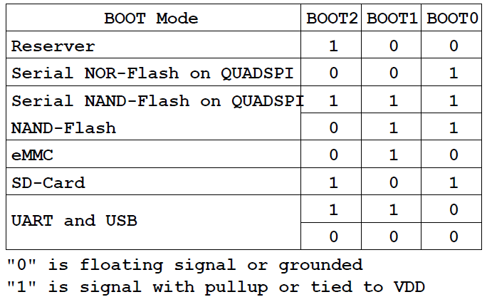
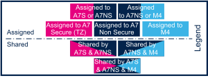
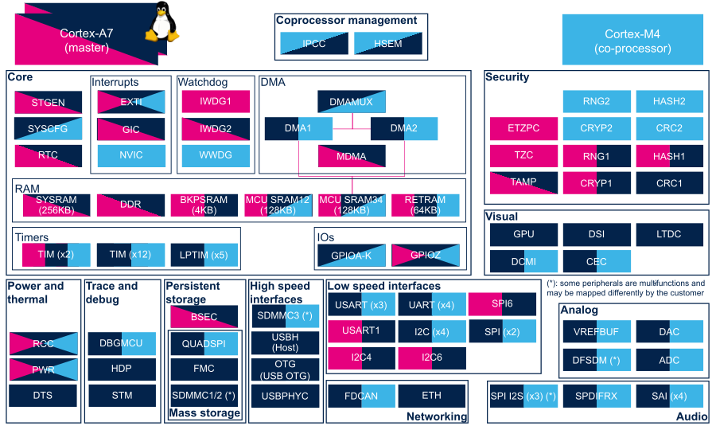
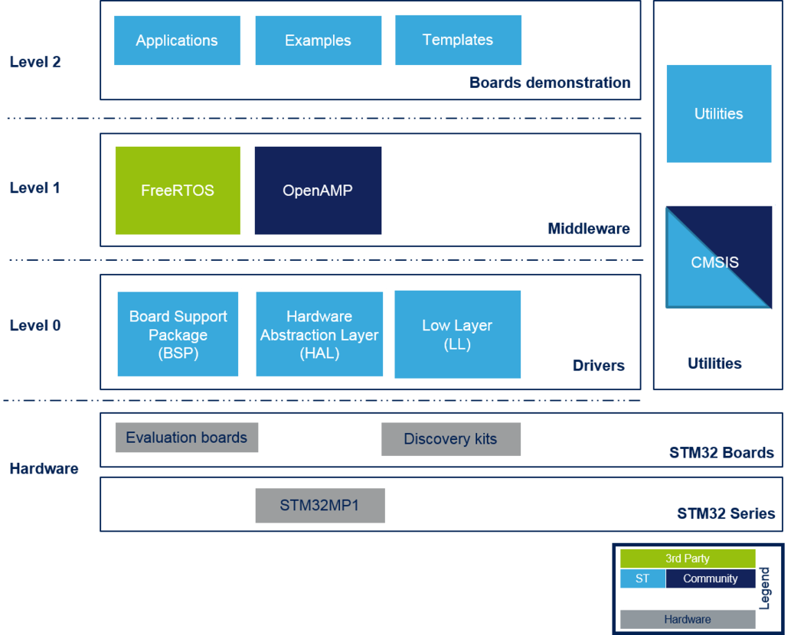
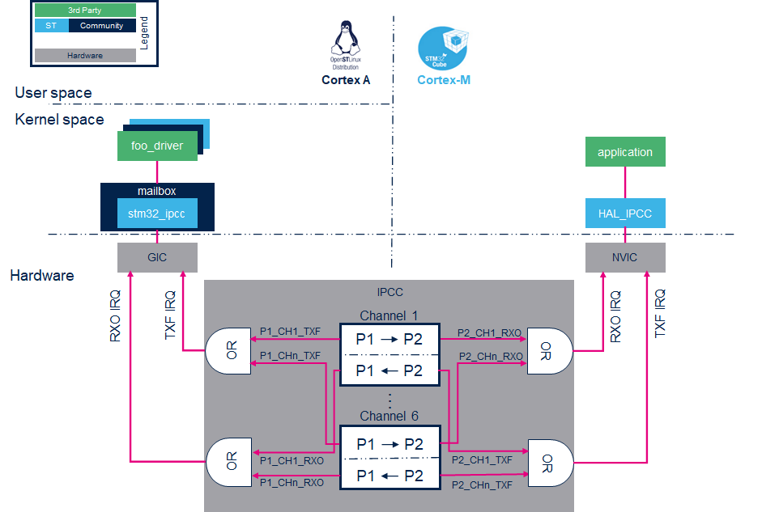
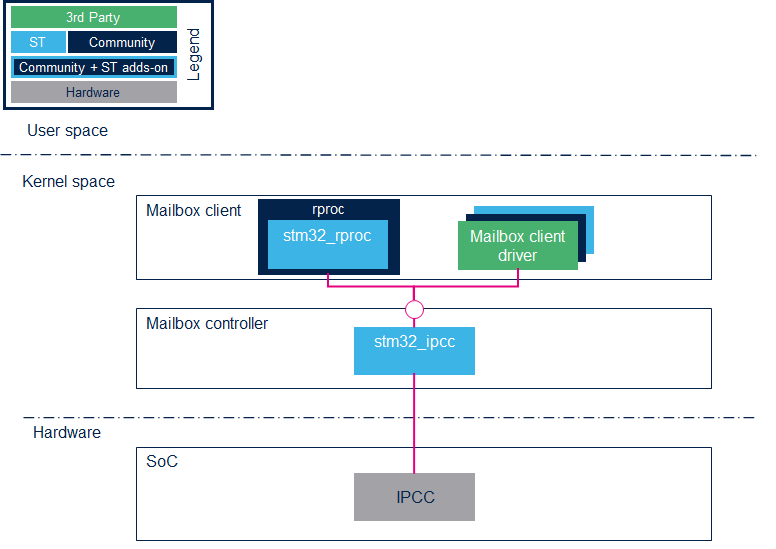
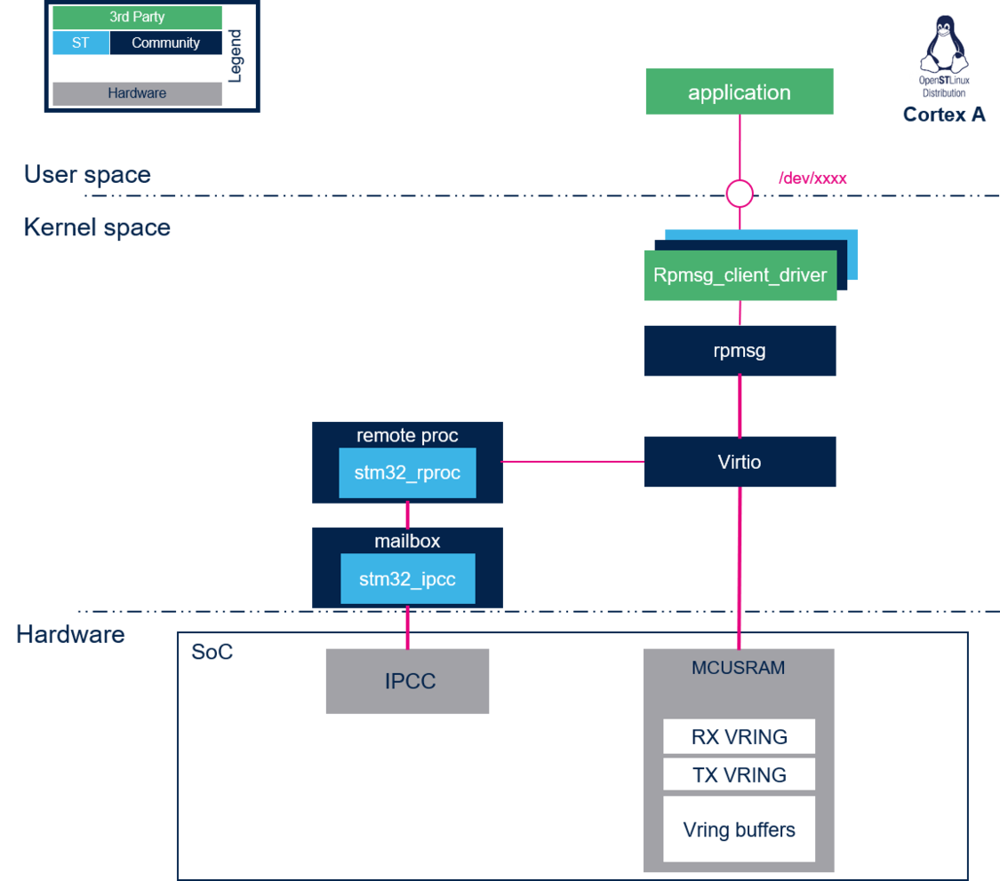
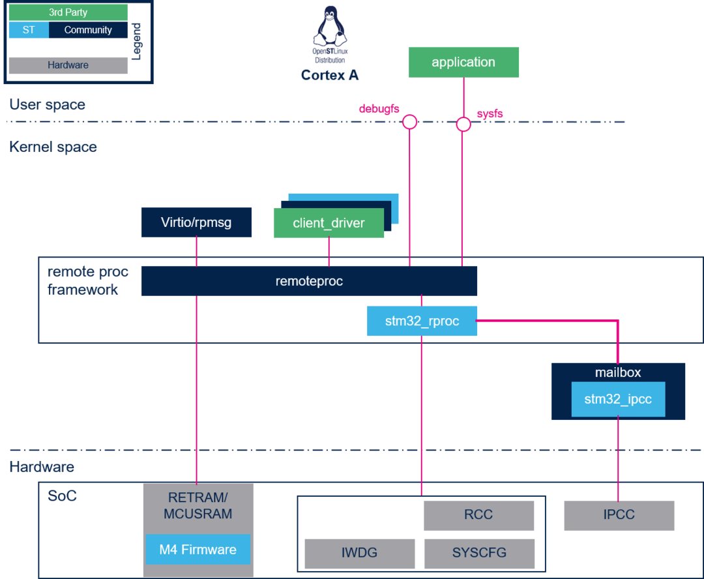
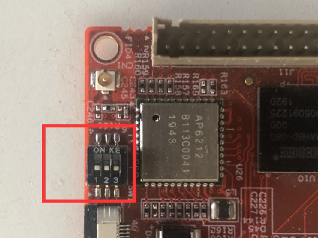

[[toc]]

# STM32MP157A和IPCC

STM32MP157 是基于 ARM 的 32 位的 MPU，很多厂商都基于这个 MPU 包装了开发板，这类板子很有意思的地方在于 ST 的这款 MPU 搭载了两个处理器，其中一个包含两颗 ARM Cortex A7，另一个则是单个 ARM Cortex M4。前者可以用来运行 Linux，且具有可信执行环境；后者一般用来管理传感器或可以运行一些实时物联网操作系统，比如 RTOS、TencentOS-tiny 等。

关于MPU和MCU的区别，参考了[知乎相关专栏](https://zhuanlan.zhihu.com/p/106860696?utm_source=wechat_session)。MPU的全称叫Micro Processor Unit，MCU的全称是Mirco Controller Unit。首先这两个词都有一个Micro开头，其实这就表明了这是计算/控制单元小型化后出现的技术。原来有多片分立的元件组成的计算机系统向高度集成化发展，多个芯片/元件的功能在向一颗芯片集中。

搭载MCU的计算机系统不承担主要的工作负载，而主要是起辅助/协调/控制作用。因此这种情况下集成化的计算机系统就不太需要强大的计算/处理能力。所以对应的形态应该是运行频率低、运算能力一般，但是需要集成化程度高（使用方便）、价格低廉（辅助系统不应增加太多成本）等因素。而随着ARM的32位MCU的出现，采用ARM的M系列的MCU也开始逐步扩大市场。以ST、NXP公司的产品为主要代表。MPU从一开始就定位了具有相当的处理和运算能力，一帮需要运行较大型的操作系统来实现复杂的任务处理。因此这就决定了MPU应该具备比较高的主频，和较为强大的运算能力。

ARM Cortex芯片系列：

- ARM Cortex-A：支持 ARM和Thumb指令集，并支持虚拟地址和内存管理，用于应用领域。
- ARM Cortex-R：支持 ARM和Thumb指令集，只支持物理地址，支持内存管理，用于实时性领域。
- ARM Cortex-M：只支持Thumb指令集，用于微处理器领域。

## 硬件

搭载的 SOC 是 STM32MP157AAA3，在 STM32Cube 里面记住选这个。

板子上还有一个缩写为 MPU 的东西，叫 Memory Protection Unit，即内存保护单元，其作用如下

- 阻止用户应用程序破坏操作系统使用的数据。
- 阻止一个任务访问其它任务的数据区，从而把任务隔开。
- 可以把关键数据区设置为只读，从根本上消除了被破坏的可能。
- 检测意外的存储访问，如，堆栈溢出，数组越界。
- 此外，还可以通过MPU设置存储器regions的其它访问属性，比如是否缓冲等。

仿真器上可以接一路板子上的调试串口来调试 Cortex M4 上的程序，用 USB OTG 和电脑连接。

板子上的的 USB OTG 是用来做数据传输、镜像烧录的。

在 Wi-Fi 蓝牙天线接口的旁边有一个拨片开关是用来设置启动配置的，实测和下图中定义的不符？

- **001**是工程模式（写字母的一端上方，代表1；写数字的一端下方，代表0）。可以进行 Cortex M4 的开发和调试。
- **010**是让 Cortex A7 加载 TF 卡内镜像启动， **000** 是烧录镜像给板载 Flash，**101**是加载板载 Flash 内镜像启动。
- 注意 0 和 1 可能搞反，启动 / 调试不了拨过来重新试一下。



电源旁边的是 reset 键，另一个是可以自定义的按键。

因为 MPU 内部的接口是固定的，板子则是厂商自定义的，所以在**使用板子前需要在 STM32CubeMX 里先设定好用到的接口**。在原理图目录下的 pdf 中可以查看开发版上的引脚。比如第十三章中讲解 GPIO 的，查到引脚是 PZ5，PZ6，PZ7，于是在STM32CubeIDE中需要调用STM32CubeMX工具，将这几个引脚设置为GPIO_OUTPUT。

STM32MP157 有三个运行环境，有一些 peripheral 在某些 context 是没法用的。

-  Arm dual core Cortex-A7 secure (Trustzone), running a Secure Monitor or Secure OS like [OP-TEE](https://wiki.stmicroelectronics.cn/stm32mpu/wiki/OP-TEE_overview)
-  Arm dual core Cortex-A7 non secure , running [Linux](https://wiki.stmicroelectronics.cn/stm32mpu/wiki/STM32MP15_Linux_kernel_overview)
-  Arm Cortex-M4 (non-secure), running [STM32Cube](https://wiki.stmicroelectronics.cn/stm32mpu/wiki/STM32CubeMP1_architecture)

大多数 peripheral 只能分配给一个 context，比如[USART](https://wiki.stmicroelectronics.cn/stm32mpu/wiki/USART_internal_peripheral) 和 [I2C](https://wiki.stmicroelectronics.cn/stm32mpu/wiki/I2C_internal_peripheral)。
有一些则可以在多个 contexts 之间共享，一般是系统的 peripheral 如 [PWR](https://wiki.stmicroelectronics.cn/stm32mpu/wiki/PWR_internal_peripheral) 和 [RCC](https://wiki.stmicroelectronics.cn/stm32mpu/wiki/RCC_internal_peripheral)。

具体的分配规则如下两图所示，第一幅图是第二幅图的图例，文字版见官方[wiki](https://wiki.stmicroelectronics.cn/stm32mpu/wiki/STM32MP15_peripherals_overview)。





## 软件工具

STM32CubeProgrammer 是用来烧录镜像的工具。

STM32CubeMX 可提供以下服务（在使用前一般要对 MPU 内部的 peripheral 进行设置，MPU 外部是做开发板的人已经连好的）：

- STM32 微控制器和微处理器的选择
- 引脚排列，时钟，外设和中间件配置
- 项目创建和初始化代码的生成

**STM32CubeIDE 是集成了 STM32CubeMX** 的 IDE ，创建项目的时候就可以自动加载它先进行引脚等的配置，同时该IDE还自带了 ARM 工具链和 GDB 调试工具。

在用 STM32CubeIDE 进行初始化设置的时候，**记得在 Project Manager 中勾选 “Generate peripheral initialization as a pair of '.c/.h' files per peripheral”**，这样生成的代码更容易阅读。

同时在**设置引脚的时候，记得右键勾选 pin reserved**，把引脚分配给某个运行上下文（context 在后面 IPCC 部分也会提到），否则按照默认设置是 free，就只是设置了引脚为输入、输出等，但是还是不知道是哪个 cpu 控制着它，STM32CubeMX 就不会自动为我们生成初始化代码。

配置完成后使用 "ctrl+s" 就可以自动保存配置并生成初始化代码。

## 学习笔记

华清远见教程手册第三部分是 Cortex M4 的实验内容；第四部分是 Cortex A7 的实验内容。

### Cortex M4

先来看一下架构图，我们在编程时，只需要操作硬件抽象层（HAL层）的 API 就行了。



#### GPIO 

华清远见教程 P247 左右。

IO 口可以由软件配置成4种模式，其实操作的是GPIO 的端口模式寄存器

- 输入（复位状态）/input（reset state）
- 通用输出模式/ general purpose output mode
- 复用功能模式/ alternate function mode
- 模拟模式/ analog mode

对应的宏为 `GPIO_MODE_INPUT`，`GPIO_MODE_OUTPUT_PP`，`GPIO_MODE_OUTPUT_OD`， `GPIO_MODE_AF_PP`，`GPIO_MODE_AF_OD`，分別是对应不同的寄存器值。

IO 操作重要结构体：`GPIO_InitTypeDef`中定义了Pin、Mode、Pull、Speed、Alternate。

设置 GPIO 引脚调用的HAL 函数：
`void HAL_GPIO_WritePin(GPIO_TypeDef* GPIOx, uint16_t GPIO_Pin, GPIO_PinState PinState);`
第一个参数传的是GPIO 所在的组，第二个是该组的几号管脚，第三个是对管脚进行置位。

#### 按键扫描

华清远见教程 P247 左右。

`void HAL_GPIO_WritePin(GPIO_TypeDef* GPIOx, uint16_t GPIO_Pin, GPIO_PinState PinState)`可以读引脚输入值，默认是 pullup，所以按下后是 0 。

`void HAL_GPIO_TogglePin(GPIO_TypeDef* GPIOx, uint16_t GPIO_Pin, GPIO_PinState PinState)`来对输出引脚值取反。

#### 外部中断

除了常规的设置引脚以外，记得要在左侧列表下的 GPIO 设置项目的 NVIC 界面中勾选使能对应的中断，否则要自己在 `gpio.c` 中启用外部中断并定义优先级

```c
HAL_NVIC_SetPriority(EXTI0_IRQn, 1, 0);
HAL_NVIC_EnableIRQ(EXTI0_IRQn);
```

同时要在 `stm32mp1xx_it.h/c` 中定义 `void EXTI0_IRQHandler(void)`，调用 `HAL_GPIO_EXTI_IRQHandler(GPIO_PIN_XXX)`，同时注册一个回调函数 `void HAL_GPIO_EXTI_Rising_Callback(uint16_t GPIO_Pin)`。同时要尽可能避免在中断处理程序（ISR）中去调用 `HAL_Delay()`，因为后者也是通过中断实现的，用在一起需要调整 ISR 的优先级。

#### 串行通讯接口

串口通信的概念非常简单，串口按位（bit）发送和接收字节。尽管比按字节（byte）的并行通信慢，但是串口可以在使用一根线发送数据的同时用另一根线接收数据。串口通信是异步的。串口通信最重要的参数是波特率、数据位、停止位和奇偶校验。

- 波特率：这是一个衡量通信速度的参数。它表示每秒钟传送的bit 的个数。例如 300 波特表示每秒钟发送300 个bit。当我们提到时钟周期时，我们就是指波特率。例如如果协议需要4800波特率，那么时钟是4800Hz。这意味着串口通信在数据线上的采样率为4800Hz。通常电话线的波特率为14400，28800 和36600。波特率可以远远大于这些值，但是波特率和距离成反比。高波特率常常用于放置的很近的仪器间的通信，典型的例子就是GPIB 设备的通信。

- 数据位：这是衡量通信中实际数据位的参数。当计算机发送一个信息包，实际的数据不会是8 位的，标准的值是5、7 和8 位。如何设置取决于你想传送的信息。比如，标准的ASCII码是0～127（7 位）。扩展的ASCII 码是0～255（8 位）。如果数据使用简单的文本（标准ASCII 码），那么每个数据包使用7 位数据。每个包是指一个字节，包括开始/停止位，数据位和奇偶校验位。
- 停止位：用于表示单个包的最后一位。典型的值为1 ，1.5 和2 位。这里的1.5 位的数据宽度，就是1.5 个波特率，由于数据是在传输线上定时的，并且每一个设备有其自己的时钟，很可能在通信中两台设备间出现了小小的不同步。因此停止位不仅仅是表示传输的结束，并且提供计算机校正时钟同步的机会。适用于停止位的位数越多，不同时钟同步的容忍程度越大，但是数据传输率同时也越慢。
- 奇偶校验位：在串口通信中一种简单的检错方式。有四种检错方式：偶、奇、高和低。当然没有校验位也是可以的。对于偶和奇校验的情况，串口会设置校验位（数据位后面的一位），用一个值确保传输的数据有偶个或者奇个逻辑高位。例如，如果数据是011，那么对于偶校验，校验位为0，保证逻辑高的位数是偶数个。如果是奇校验，校验位位1 ，这样就有3 个逻辑高位。高位和低位不真正的检查数据，简单置位逻辑高或者逻辑低校验。这样使得接收设备能够知道一个位的状态，有机会判断是否有噪声干扰了通信或者是否传输和接收数据是否不同步。
- 硬件流控制: 硬件流控制常用的有RTS/CTS 流控制和DTR/ R（数据终端就绪/数据设置就绪）流控制。硬件流控制必须将相应的电缆线连上，用RTS/CTS（请求发送/清除发送）流控制时，应将通讯两端的RTS、CTS 线对应相连，数据终端设备（如计算机）使用RTS 来起始调制解调器或其它数据通讯设备的数据流，而数据通讯设备（如调制解调器）则用CTS 来起动和暂停来自计算机的数据流。这种硬件握手方式的过程为：我们在编程时根据接收端缓冲区大小设置一个高位标志（可为缓冲区大小的75％）和一个低位标志（可为缓冲区大小的25％），当缓冲区内数据量达到高位时，我们在接收端将CTS 线置低电平（送逻辑0），当发送端的程序检测到CTS 为低后，就停止发送数据，直到接收端缓冲区的数据量低于低位而将CTS 置高电平。RTS 则用来标明接收设备有没有准备好接收数据。

STM32 串口设置一般可以总结为如下几个步骤：

1. 串口时钟使能，GPIO 时钟使能
2. 设置引脚复用映射
3. GPIO 初始化设置,模式为复用功能
4. 串口参数初始化：设置波特率，字长，奇偶校验等参数
5. 开启中断并初始化NVIC，使能中断（如果需要开启中断才需要这个步骤）
6. 使能串口
7. 编写中断处理函数

相关 HAL API：

`HAL_UART_Transmit(UART_HandleTypeDef *huart, uint8_t *pData, uint16_t Size, uint32_t Timeout);` 轮询方式发送。

`HAL_UART_Receive(UART_HandleTypeDef *huart, uint8_t *pData, uint16_t Size, uint32_t Timeout);` 轮询方式接收。

`HAL_UART_Transmit_IT(UART_HandleTypeDef *huart, uint8_t *pData, uint16_t Size);` 中断方式发送，需要重载 `void HAL_UART_RxCpltCallback(UART_HandleTypeDef *huart);` 。

`HAL_UART_Receive_IT(UART_HandleTypeDef *huart, uint8_t *pData, uint16_t Size);` 中断方式接收，需要重载 `void HAL_UART_TxCpltCallback(UART_HandleTypeDef *huart);` 。

在配置时，除了需要找到 UART4 的 TX 和 RX 对应的引脚外，还需要在左侧列表中找到 UART4，并把它在 Cortex-M4 上激活，激活后，模式下拉选择 Asynchronous，如果要用中断方式，需要在 NVIC Settting 栏下勾选 Enabled 使能串口中断。


#### HSEM

STM32MP157 手册第 11 章。

在讨论 IPCC 之前，STM32MP1官方 wiki 里也提到了 HSEM， 即 Hardware Semaphore，说是用于coprocessor的，但是读了STM32MP157的手册发现似乎是用于 Cortex A7 的两个核的。

HSEM总共设计了32个32位（4 Bytes）的寄存器用于存储信号量，对这些寄存器的读写都是以字节（4 Bytes）为单位的，以半字、Byte方式读写是无效的。

关于信号量的使用，有一本很好的书，**[The Little Book Of Semaphores](https://www.researchgate.net/publication/249954903_The_Little_Book_of_Semaphores)**。

#### IPCC 

STM32MP157 手册第 12 章、[官方wiki](https://wiki.stmicroelectronics.cn/stm32mpu/wiki/IPCC_internal_peripheral)。

IPCC全称 inter-processor communication controller 可以用来在两个处理器间传递数据，他提供的是 non-blocking 的信号机制，使用原子操作发送和获取信息。视通信的模式，可能会用从 MCU SRAM 中分划出一部分作为共享内存。IPCC是不安全的 peripheral。在启动时无法使用。

IPCC peripheral 提供了管理 IPCC 通信的机制。每个处理器都有自己独立的寄存器组和中断。

该芯片上共有6条双向通道，每条通道又被划分为两条朝向相反的单向的子通道。

##### 单向子通道

子通道包含：

- 一个 flag，该 flag 在occupied 和 free 之间变化，当发送数据时，发送方可以设置为 occupied，接收方收到后清空为 free。去看手册会发现，他是靠寄存器实现的，事实上可以看成是 hardware 的 semaphore 或者是 mutex :happy:，起到互斥的作用 。
- 两个相关的中断。这两个中断在不同通道间是共享的，也就是说同一时刻只有一个通道可以触发中断让处理器对他进行读写。即使是你有办法让 6 条通道火力全开，并行传输，也会受到这里的限制。这在下面的概况图中表示为外围设备部分的6条通道，是共同经过一个 OR 门触发 IRQ 的。
  - RXO："receiver" 端的 RX 通道被占用，即Rx_Occupied
  - TXF："sender" 端的 TX 通道是空闲的，即Tx_Free
- 两个相关的中断掩码

##### 通信模式

理论上 IPCC 可以有三种运行通信模式：

- Simplex communication mode
  - 只使用一个子通道。
  - 单向信息：一旦发送方的处理器已经向内存发送了数据，他就立刻把信道状态 flag 设置为 occupied 状态；接收方一旦读取完了信息就把 flag 清除为 free 状态。
- Half-duplex communication mode
  - 只使用一个子信道。
  - 双向信息：一旦发送方的处理器已经向内存发送了数据，他就立刻把信道状态 flag 设置为 occupied 状态；当接收方读取完信息且 response 在共享内存中可用了，再清空 flag。
- Full-duplex communication mode
  - 以异步的方式使用子信道。
  - 通过将信道设置为 occupied 状态，任何一个处理器都可以异步地发送信息；当接收处理器收到信息后，清楚 flag。该模式可以被视为两个 simplex 模式在一个给定信道上的结合。

但是STM32MP157的手册中只有前两种，下面分别给出具体的电位图，理解起来更方便：


##### 架构

IPCC的架构为

- IPCC processor 1 是 Cortex-A7 non-secure， 使用[Linux mailbox framework](https://wiki.stmicroelectronics.cn/stm32mpu/wiki/Linux_Mailbox_framework_overview)进行管理。
- IPCC processor 2 是 Cortex-M4，适应 [IPCC HAL driver](https://wiki.stmicroelectronics.cn/stm32mpu/wiki/STM32CubeMP1_architecture)进行管理。

可以用下图概括



##### Linux Mailbox <div id="mailbox"/>

Mailbox框架用于异构多核系统中处理器之间的数据和信号传递。该框架下有 controller 和 client：

- Controller 用来设置和管理来自 IPCC peripheral 的 IRQ，叫 stm32_ipcc。
- Client 用来管理数据的发送和接收，用户可以自定义Client，例如 RPMsg 框架使用了该 mailbox 进行处理器间的通信，在这种情况下 Client 就是 remoteproc 驱动。

架构图如下



使用细节参见文档：

https://github.com/STMicroelectronics/linux/blob/v5.4-stm32mp/Documentation/mailbox.txt

https://github.com/STMicroelectronics/linux/blob/v5.4-stm32mp/include/linux/mailbox_controller.h

https://github.com/STMicroelectronics/linux/blob/v5.4-stm32mp/include/linux/mailbox_client.h

具体设置参见：

[Linux mailbox framework](https://wiki.stmicroelectronics.cn/stm32mpu/wiki/Linux_Mailbox_framework_overview)

https://wiki.stmicroelectronics.cn/stm32mpu/wiki/Menuconfig_or_how_to_configure_kernel

##### RPMsg <div id="rpmsg"/>

RPMsg是基于 **virtio** 的 messaging bus，允许本地处理器和远程处理器进行交流。它是用 virtio vring 在共享内存上发送和接收数据的。

具体而言，vring 是单向的，总共需要开两个实现双向传输，在两个处理器都能看到的内存空间上会开辟共享的 buffer。使用 [Mailbox framework](#mailbox) 来通知处理器在共享内存中有待读取的数据。

基于这些框架， RPMsg框架实现了一个基于信道的通讯方式，信道使用文本信息进行区分，同时有本地地址和远端地址，类似 socket 通信？需要注意的是在远端也需要实现 RPMsg框架，具体的实现有很多种，比较出名的是 [**OpenAMP**](https://www.openampproject.org/)。

在 RPMsg client 的实现中，需要关注两个概念：

- RPMsg channel：

  RPMsg  client 是关联于 RPMsg channel 的，RPMsg channel 建立在本地和远端处理器之间。client使用文本信息，即 service name，注册在 RPMsg 框架中，当找到了本地注册过的服务名和远端发布的服务名，就建立通讯信道。

- RPMsg endpoint：RPMsg 端点通过RPMsg 信道，提供逻辑连接。一个端点有它独特的地址和对应的回调函数，允许用户在同一个信道上绑定多个端点。当一个用户驱动用本地地址创建了一个端点，所有目标地址和该端点本地地址相同的到达数据都会被路由到该端点。注意每个信道有一个默认的端点，所以应用即使不创建新端点，也可以进行通信。

架构图如下



文档：https://www.kernel.org/doc/Documentation/rpmsg.txt

##### RPROC

全称为 remote processor (RPROC) ，该框架允许不同的平台、架构忽略硬件差异去远程管理（开关、加载固件）其他处理器

STM32MP157中，有两个组成部分

**remoteproc**，抽象的远程处理器管理框架，功能如下：

- 在远程处理器的内存中加载 ELF firmware
- 解析 firmware resource table ，以控制相关资源（例如IPC、memory）
- 控制远程处理器的执行，远程让他运行或停止
- 提供检测、debug 远程固件的服务

**stm32_rproc**，ST公司编写特定的远程处理器驱动，功能如下：

- 将供应商编写的特定回调函数注册到 RPROC 框架中
- 管理远程平台中与处理器相关的资源（例如 registers、watchdogs、reset、clock 和 memories）
- 通过 mailbox 框架向远程的处理器推送通知（kicks）

架构图如下，[RPMsg](#rpmsg) 是建立在 RPROC 之上的，但是也有直接使用RPROC的其他应用如 sysfs 和 debugfs。



文档：https://www.kernel.org/doc/Documentation/remoteproc.txt

##### peripheral 设置

IPCC peripheral 连接了 Cortex A7 和 Cortex M4，因此需要在两个处理器上都进行设置，内部的 peripheral 在使用时候需要通过STM32CubeMX对板子进行设置

默认设置 processor1 是 Cortex A7 non-secure，processor2 是 Cortex M4。信道默认按下表设置

| 信道  | 模式    | 用途                      | 软件框架（A7） | 软件框架（M4）         |
| ----- | ------- | ------------------------- | -------------- | ---------------------- |
| 信道1 | 全双工  | M4发送，A7接收            | RPMsg          | OpenAMP                |
| 信道2 | 全双工  | A7发送，M4接收            | RPMsg          | OpenAMP                |
| 信道3 | Simplex | 用于终止 Cortex M4 的运行 | RemoteProc     | CprocSync cube utility |
| 信道4 |         | free                      |                |                        |
| 信道5 |         | free                      |                |                        |
| 信道6 |         | free                      |                |                        |

IPCC相关设置不能直接单独在某个 context 下开启，一定是两个处理器都参与其中的，在STM32CubeMX中需要设置成 A7 non-secure 和 M4 两个 context。

##### 相关代码

华清远见整理的资料中的相关的 HAL 和 LL 层的源码：

- `\Cortex-M4\STM32Cube_FW_MP1_V1.2.0\Drivers\STM32MP1xx_HAL_Driver\Inc\stm32mp1xx_ll_ipcc.h`
- `\Cortex-M4\STM32Cube_FW_MP1_V1.2.0\Drivers\STM32MP1xx_HAL_Driver\Src\stm32mp1xx_hal_ipcc.c`
- `\Cortex-M4\STM32Cube_FW_MP1_V1.2.0\Drivers\STM32MP1xx_HAL_Driver\Inc\stm32mp1xx_hal_ipcc.h`

### Cortex A7

#### 环境搭建

首先安装了Xshell用于串口调试，之后需要安装 STM32CubeProgrammer，在 STM32 平台上的 Flash 设备中创建分区并对各个分区进行镜像烧录。可以使用 STM32CubeProgrammer工具来烧录 STM32 MPU板上支持的所有 Flash 设备，可以对 eMMC 和 SDCard中的镜像更新。

#### OpenSTLinux源码编译

教程第 35 章，P382 左右

#### OpenSTLinux镜像烧录

教程第 36 章，P401 左右

该板子支持通过 STM32CubeProgrammer 工具进行镜像的烧录，还可以通过 BootLoader下的 ums 工具配合 ubuntu 系统进行单个镜像更新，使用 TFTP 下载方式进行镜像的下载，使用 scp 方式更新 linux 内核和设备树。

在烧录前需要将开发板断电，挑战拨码开关，将开关拨到 **000**。



使用 USB 方式烧写镜像的时候，要用 USB mini 线来进行数据传输，注意这里是接在板子上的那个 USB mini。

同时接上调试器的 USB mini，根据设备管理器里的端口信息，打开 Xshell，在连接选项中选择 Serial 连接协议，然后设置好端口号等信息，然后进行连接。

之后打开 STM32CubeProgrammer，开发板上电，在右上角切换到USB连接设置下，可以看到接着板子的 USB 端口（如果看不到尝试复位），点击 Connect 按钮，右上角会显示为绿色的 Connected。

打开镜像所在目录，不同文件夹下是不同的 tsv 格式的配置文件。例如文件名称中带有 emmc 的是片上 flash 烧录设置，而 sdcard 的是 TF 卡的烧录配置，后缀带有 trusted 和 optee 的是不同的启动模式，二者均为带有安全机制的启动方式。烧录前需要将配置文件复制到上级目录中，和镜像文件放在一起（也可以不移动，在后面的 STM32CubeProgrammer 中选择 binaries path）。在 STM32CubeProgrammer 中，点击 Open File，选择刚刚复制过去的配置文件。等待几分钟即可完成烧录，将开关拨片拨至 **010** 来启动系统。

也可以通过 USB Image Tool 工具制作 TF 系统卡。在 USB Image Tool 中可以看到 TF 卡和读卡器，读到盘符后将 raw 格式的 Weston 镜像。打开 Favorites 选项卡，添加一个镜像后点击 Restore， 等待烧录完成后，将开关拨片拨至 **101** 来启动系统。

### 利用 OpenAMP 的多核协同工作（A7 和 M4 通信）

第 56 章， P613 附近

源码在 `\Cortex-M4\STM32Cube_FW_MP1_V1.2.0\Projects\STM32MP157A-FSMP1\Applications\OpenAMP\OpenAMP_TTY_echo` 目录下

需要将整个文件目录都导入 STM32CubeIDE，同时需要连接两条 USB mini 线，开发版会被识别为 RNDIS 网络适配器设备，在设备管理器中如果找不到该设备，可能是被识别成了串口或 USB 设备，需要卸载驱动重装。还不能用只能换线、换电脑试试了。

下面记录下 STMicroelectronics Micro Controller Development Application Team 的文档中对该示例的描述。

该示例主要演示了如何使用 OpenAMP MW 和 Virtual UART 来创建看上去就像 Linux 系统中的 TTY 一样的设备的处理器间通讯通道。

在该示例中，调用的是 CPU2 （Cortex-M4，CM4）上的固件，默认的 CPU1 是 Cortex-A7 (CA7)，在 CPU1 上需要运行 Linux。

OpenAMP MW 使用下列硬件资源：

- IPCC peripheral，用来在 CA7 和 CM4 之间传递事件信号（mailbox）。

- MCU SRAM peripheral 用来缓存通信信息 (virtio buffers) 。
- 该例子中保留的共享内存区域：SHM_ADDR=0x10040000，SHM_SIZE=128k。它定义在 `platform_info.c` 文件中。

在这个例子中：

- CPU2 初始化 OpenAMP MW ，OpenAMP 通过 硬件抽象层（HAL）初始化了 IPCC peripheral，设置了 openamp-rpmsg 框架。

- CPU2 创建了 两个 rpmsg 信道给 两个虚拟的 UART 实例 UART0 和 UART1。

- CPU2 在两条信道上等待来自 CPU1 的消息。

- 当 CPU2 接收到来自一个虚拟 UART 实例 / rpmsg 信道的消息时，它在同一个 UART 实例 / rpmsg 信道上将消息发送回 CPU1。

**注意**：

- 在 Cortex-A7 上需要烧录好 Linux
- 在 Cortex-M4 上 logging 被重定向到了 MCUSRAM 的共享内存中，能够在 Linux 的控制台中进行展示，使用这个命令即可查看 `cat /sys/kernel/debug/remoteproc/remoteproc0/trace0`

- 下面的命令需要在 Cortex-A7 的 Linux 控制台中运行，在执行完这个命令后，在 Linux 控制台中我们会得到 `"Hello Virtual UART0"` 和 `"Hello Virtual UART1"`。也就是说，在 CA7 中 Linux 是把消息通道识别成了一个文件描述符 （事实上，所有的文件、外设都是这样的，直接在文件系统中，当做一个普通的文件来处理，应该也是使用 socket 在通信）。

    ```shell
    stty -onlcr -echo -F /dev/ttyRPMSG0
    cat /dev/ttyRPMSG0 &
    stty -onlcr -echo -F /dev/ttyRPMSG1
    cat /dev/ttyRPMSG1 &
    echo "Hello Virtual UART0" >/dev/ttyRPMSG0
    echo "Hello Virtual UART1" >/dev/ttyRPMSG1
    ```
	

**注意**：

当使用 `HAL_Delay()`的时候，一定要小心，该函数基于 HAL 中时间相关的 Interrupt Service Routine （ISR） 提供的了毫秒级的准确延时。 如果在一个 peripheral ISR 中去调用 `HAL_Delay()`，那么相比 peripheral ISR，HAL 时间的中断将有更高的优先级（在数字表示上更小的优先级），否则调用方的 ISR 将会被阻塞。想要更改时间中断的优先级，我们需要使用 `HAL_NVIC_SetPriority()` 函数。我们还需要保证 HAL 时间单位总是被设置成 1 毫秒以确保我们 HAL 的行为是正确的。

该示例中的传输，Channel 1 和 Channel 2 分别承担一个方向的传输。

```C
/*
 * Channel direction and usage:
 *
 *  ========   <-- new msg ---=============--------<------   =======
 * ||      ||                || CHANNEL 1 ||                ||     ||
 * ||  A7  ||  ------->-------=============--- buf free-->  || M4  ||
 * ||      ||                                               ||     ||
 * ||master||  <-- buf free---=============--------<------  ||slave||
 * ||      ||                || CHANNEL 2 ||                ||     ||
 *  ========   ------->-------=============----new msg -->   =======
 */
```

**相关源码**

- OpenAMP/OpenAMP_TTY_echo/Inc/openamp_conf.h                     Configuration file for OpenAMP MW
- OpenAMP/OpenAMP_TTY_echo/Inc/stm32mp1xx_hal_conf.h         HAL Library Configuration file
- OpenAMP/OpenAMP_TTY_echo/Src/main.c                             Main program
- OpenAMP/OpenAMP_TTY_echo/Src/mbox_ipcc.c                        mailbox_ipcc_if.c MiddleWare configuration
- OpenAMP/OpenAMP_TTY_echo/Src/openamp.c                          User OpenAMP init
- OpenAMP/OpenAMP_TTY_echo/Src/rsc_table.c                        Resource_table for OpenAMP
- OpenAMP/OpenAMP_TTY_echo/Src/stm32mp1xx_it.c               Interrupt handlers
- OpenAMP/OpenAMP_TTY_echo/Src/system_stm32mp1xx.c           STM32MP1xx system clock configuration file

在 `openamp_conf.h` 中可以通过宏设置是使用 IPCC 还是 HSEM 作为通信机制，也可以通过宏选择是使用 UART 还是 I2C。

CM4 需要一个进程循环使用 `openamp.c` 中的 `OPENAMP_check_for_message()` 来查看是否接收到了数据，如果接收到会调用上面的回调，回调中如果拷贝了接收到的数据，此时就可以在循环中查看接收到的数据，记得清零接收到数据的标记。

CM4 需要调用 `virt_uart.c` 中的 `VIRT_UART_Transmit()` 去向 CA7 传输数据，最大传输数据不可以超过 `RPMSG_BUFFER_SIZE-16`，该常量定义在 `rpmsg_virtio.h` 中，是512，也即只能传输 496 字节的数据。所以比较可行的方法是双方互相发送字符串指令去调用对方上的函数？直接传输数据等不太现实。同时，CM4 使用`virt_uart.c`中的函数 `VIRT_UART_RegisterCallback()` 向 virtual UART Handler 注册回调函数，在接收到数据后，从 handler 中读取数据大小 `handler->RxXferSize` 和数据 `huart->pRxBuffPtr`，设置标记表示读取到数据等。`virt_uart.c` 中也定义了 `VIRT_UART_Init()`，用来调用 `OPENAMP_create_endpoint()` 创建通信端点。`VIRT_UART_read_cb()`是更低一层的接口，用来向端点所在的 `VIRT_UART_HandleTypeDef`中写入数据。注意端点本身是在  Virt UART handler 结构体中的，这里找到端点对应的 handler 的方法和 Linux 中链表的使用十分类似，也是定义了一个宏，根据结构体成员的地址和偏移量计算结构体的地址。

`mbox_ipcc.c` 中，通过 `MAILBOX_INIT()` 函数，调用`HAL_IPCC_ActivateNotification()`在两个 IPCC channel 上分别注册回调函数。在接收到数据后，回调函数中设置标志提示 `MAILBOX_Poll()`函数可以进行读取了，同时会调用提醒 CPU 在哪个 ipcc handler 上哪个通道接收到了数据。在`MAILBOX_Poll()` 中会检查两个通道上的标记，如果接收信道检测到数据或发送信道为空，则可以调用 `rproc_virtio_notified()` 来提醒 virtio_device。在 `MAILBOX_Notify()` 中则会检测信道是否为空（会等待到信道为空），提醒 CA7。 

CM4 上的常用宏

```c
// 普通标记
typedef enum
{
  RESET = 0,
  SET = !RESET
} FlagStatus, ITStatus;
// HAL的标记
typedef enum 
{
  HAL_OK       = 0x00U,
  HAL_ERROR    = 0x01U,
  HAL_BUSY     = 0x02U,
  HAL_TIMEOUT  = 0x03U
} HAL_StatusTypeDef;
// HAL中锁的标记
typedef enum 
{
  HAL_UNLOCKED = 0x00U,
  HAL_LOCKED   = 0x01U  
} HAL_LockTypeDef;
```

根据 `stm32mp1xx_hal_ipcc.c`中的注释，


- For a given channel (from 0 to IPCC_CHANNEL_NUMBER), for a given direction IPCC_CHANNEL_DIR_TX or IPCC_CHANNEL_DIR_RX, you can choose to communicate
            in polling mode or in interrupt mode using IPCC.
            By default, the IPCC HAL driver handle the communication in polling mode.
            By setting a callback for a channel/direction, this communication use
            the interrupt mode.
        
- Polling mode:
  
   -  To transmit information, use HAL_IPCC_NotifyCPU() with IPCC_CHANNEL_DIR_TX. To know when the other processor has handled
              the notification, poll the communication using HAL_IPCC_NotifyCPU  with IPCC_CHANNEL_DIR_TX.
   
   - To receive information, poll the status of the communication with
        HAL_IPCC_GetChannelStatus with IPCC_CHANNEL_DIR_RX. To notify the other
        processor that the information has been received, use HAL_IPCC_NotifyCPU
        with IPCC_CHANNEL_DIR_RX.
   
- Interrupt mode:
   - Configure a callback for the channel and the direction using HAL_IPCC_ConfigChannel().
            This callback will be triggered under interrupt.
   
   - To transmit information, use HAL_IPCC_NotifyCPU() with
            IPCC_CHANNEL_DIR_TX. The callback configured with HAL_IPCC_ConfigChannel() and
            IPCC_CHANNEL_DIR_TX will be triggered once the communication has been handled by the
            other processor.
   - To receive information, the callback configured with HAL_IPCC_ConfigChannel() and
            IPCC_CHANNEL_DIR_RX will be triggered on reception of a communication.To notify the other
            processor that the information has been received, use HAL_IPCC_NotifyCPU
            with IPCC_CHANNEL_DIR_RX.
        
   - HAL_IPCC_TX_IRQHandler must be added to the IPCC TX IRQHandler
     
   - HAL_IPCC_RX_IRQHandler must be added to the IPCC RX IRQHandler

`lock_resource.c` 中的 `Periph_Lock()` 函数可以尝试锁定 peripheral，但是如果超过时间限制还没有获取，会返回超时错误。其中设备的 HSM ID 是通过 `GET_HSEM_SEM_INDEX` 宏定义的，该宏用了很多次三目运算符对每类设备进行判断，如果都不是会返回超出 HSEM 数量的数字，在该开发板上只有32个 Hardware Semaphore，因此该数字是32 （HSEM_SEMID_MAX + 1）。这些常量一般都定义在 `stm32mp157cxx_cm4.h` 文件中。

`virtio.c` 中给了一些描述设备名和特性的函数，除此以外，是重要的 `virtio_create_virtqueues()`，用来根据一系列输入设备指针、队列数量、回调函数等参数创建多个 virtio queue，该函数返回 0 则代表创建成功。因为每次创建 virtio queue 的时候，是在调用 `virtqueue.c` 中的 `virtqueue_create()`，如果成功了，则返回 `VQUEUE_SUCCESS` 值，该常量是0 。

头文件`virtio.h`中，定义了一个函数指针表结构体 `virtio_dispatch`，附属于 `virtio_device` 结构体，意味着需要为每种支持的设备单独实现一遍这些函数。

`virtqueue.c` 定义了数据结构及其方法，`virtqueue_create()`中 virtio 队列 vq 的 `notify`函数是需要根据设备定义的。


## Tiny OS 移植

首先在 STM32CubeIDE中用 STM32CubeMX仿照 LED 和外部中断那两个示例，设置好引脚和中断。

接下来移植 Tiny OS。

在 `board` 目录下找到最接近的一个。STM32F103 是 Cortex-M3，STM32F401 是 84 MHZ Cortex-M4，STM32F407 是 168 MHZ Cortex-M4，STM32F745 是 Cortex-M7。所以我们使用 STM32F401 或 STM32F407 下面的 `board/xxx/tos_config.h`，把  `#include "stm32f4xx.h"` 修改为 `#include "stm32mp1xx.h"`（因为板子是 mp157）。

主要需要的源码就是 `arch/arm/arm-v7m/` 下的  `common` 和 `cortex-m4/gcc` （由于 STM32CubeIDE 自带了 gcc ）；`kernel` 目录下的源码；`osal/cmsis_os` 也需要一份，以便使用标准接口。

刚刚 tos_config 参考的 `board/xxx/` 示例里面，有写如何在`main.c`中启动os，添加应用。他们把板子的初始化放到 `mcu_init.c` 中了，我们也这么移动，让`main.c` 简洁一些。

在 STM32CubeIDE 中设置 `include` 目录。

重复定义项需要删掉：

- `stm32mp1xx_it.c` 自动生成的`PendSV_Handler()` 

示例中使用的 cmsis_os 是旧版的接口（新版中没有），所以要用的是 `cmsis_os.h`。或者在 `platform/vendor_bsp/st/CMSIS/RTOS2/Template` 下的 `cmsis_os.h` 中则根据预处理宏选择了头文件的版本，如果是要求用 2.0 往上的接口，会用宏做替换。

此时可以尝试编译了，成功编译后，接下来用一小段程序验证一下是否成功跑起来了os，创建一个应用入口程序：

```c
__weak void application_entry(void *arg)
{
    while (1) {
        // printf("This is a demo task,please use your task entry!\r\n");
        HAL_GPIO_TogglePin(GPIOZ, GPIO_PIN_5);
        HAL_Delay(500);
    }
}
```

正常情况应该看到 LED 闪烁。

本来还想测试按键中断，但是暂时不知道为什么启动 os 后按键中断无法触发。

如果是打算做AMP相关的实验，还需要把 IPCC 相关的都激活，这里因为是在 MPU 内部，所以不需要设置引脚。Middleware 那里把 OpenAMP 相关激活，FreeRTOS 亮着但是默认是禁用的，不用管。

后续可能会用到的源码：`platform\xx\st` 下有有关 ST 的 HAL 实现，但是目前还没有针对 stm32mp1xx 的。但是查看 `platform/hal/st/stm32f1xx/src/tos_hal_uart.c` 和 `platform/hal/st/stm32f4xx/src/tos_hal_uart.c` 后，发现并没有多大的区别，只是 stm32f1xx 板子上的 `HAL_UART_Transmit()` 函数会返回状态值，可以判断是否传输成功，那么对 stm32mp1xx，用到的时候自己去看着改一下就行了。


