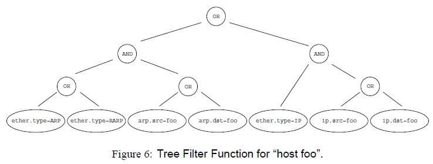
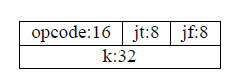

[[toc]]

# BPF和eBPF

## BPF论文笔记

该文章由 UCB 发表在 1992 年的 Winter USENIX，题目是《The BSD Packet Filter: A New Architecture for User-level Packet Capture》。

BPF 全名为 BSD Packet Filter，最初被应用于网络监测，例如知名的`TCPdump` 工具中，它可以在内核态根据用户定义的规则直接过滤收到的包，相较竞争者 CSPF 更加高效。它设计了一个基于寄存器的虚拟机用来过滤包，而 CSPF 则使用的是基于栈的虚拟机。

BPF 有两个组成部分：

- Tap 部分负责收集数据
- Filter 部分负责按规则过滤包


收到包以后，驱动不仅会直接发给协议栈，还会发给 BPF 一份， BPF根据不同的filter直接“就地”进行过滤，不会再拷贝到内核中的其他buffer之后再就行处理，否则就太浪费资源了。处理后才会拷贝需要的部分到用户可以拿到的 buffer 中，用户态的应用只会看到他们需要的数据。

注意在BPF中进行处理的时候，不是一个一个包进行处理的，因为接收到包之间的时间间隔太短，使用`read`系统调用又是很费事的，所以 BPF 都是把接收到的数据打包起来进行分析，为了区分开这些数据，BPF 会包一层首部（header），用来作为数据的边界。

作者先比较了两种极端的情况，在接收所有包和拒绝所有包的情况下 BPF 和竞争者 NIT 的表现。


横轴是包的大小，纵轴是平均时间开销，斜率是读写速度。y轴上的截距是包长为0时候，也即对于每个包来说，固定的调用 filter 的开销。由于需要分配和初始化 buffer，NIT 调用时长在 80-100 微秒，而 BPF 则只要 5 微秒。除此以外，随着包长增加，可以看到当接受所有包时，虽然都会将包拷贝到 buffer 中，BPF 要更快一些。同时，当拒绝所有包的时候，由于 BPF 直接就地过滤掉了所有的包，不需要任何拷贝，所以它的开销几乎是常数，即固有的 filter 调用时间。

在网络监测中，一般来说（除非开启混乱模式），丢弃的信息要多于需要的信息，因此 BPF 在一般情况下优势巨大。

事实上，一个 filter 就好似一个断言，或真或假，代表是否需要该包。

为了验证断言，CSPF 采用的是如下的树形结构，好处是思路清晰。但是遍历树时需要使用栈，每次或者向栈中推入常量或包的数据，或者在栈顶两个元素之间进行二元运算。在跑完整个树结构后，再读取栈顶元素，如果是非零值或栈是空的，才会接收该包，否则丢弃。就算可以使用短路运算去优化实现代码，也依然有很大问题，首先网络是分层的，包结构里有很多首部，逐层嵌套，每次进行判断都要重新拆解包。其次接收也是接收一整个包，而不去考虑会有很多不需要的数据，明显是比 BPF 低效的。



而 BPF 则使用了下图的 CFG（Control Flow Graph）， CFG 是一个 DAG (Directed Acyclic Graph)，左边分支是说明节点是 false，右边分支是说明节点是 true。该结构运算时更多地使用寄存器，这也是一个更快速的原因。该方法的问题就是 DAG 怎么构造，怎么排序，这本身是另一个算法问题了，文中没有进行讨论。


BPF 的虚拟机设计，没有采用三地址形式的代码，而是采用的多为二元运算、单地址的运算。它也定义了一系列如下的 32 位的运算指令。在实现时是用的宏，但是在文中为了便于阅读，用了汇编形式。注意到取址运算很多是相对于包来说的，因为本来这个虚拟机就是用来分析包的。




由于数据在包中的位置不固定，BPF 定义了一个运算来简化地址运算的步骤，即 `4*([14]&0xf)` ，其实是在分析 IP header，乘 4 是因为 offset 是字长为单位，是 4 个字节。是下面代码的缩写。


## eBPF (extended BPF)

[官方网站](https://ebpf.io/zh-cn/)。

Linux 内核一直是实现监控/可观测性、网络和安全功能的理想环境。 不过很多情况下这并非易事，因为这些工作需要修改内核源码或加载内核模块， 最终实现形式是在已有的层层抽象之上叠加新的抽象。 eBPF 是一项革命性技术，它能在内核中运行沙箱程序（sandbox programs）， 而无需修改内核源码或者加载内核模块。

将 Linux 内核变成可编程之后，就能基于现有的（而非增加新的）抽象层来打造更加智能、 功能更加丰富的基础设施软件，而不会增加系统的复杂度，也不会牺牲执行效率和安全性。


[Ingo Molnár](https://lkml.org/lkml/2015/4/14/232) 在 2015 年在提议合并 Linux 分支时这样描述 eBPF ：

> One of the more interesting features in this cycle is the ability to attach eBPF programs (user-defined, sandboxed bytecode executed by the kernel) to kprobes. This allows user-defined instrumentation on a live kernel image that can never crash, hang or interfere with the kernel negatively.

## 主要项目

[**项目列表**](https://ebpf.io/projects/)

### BCC: Toolkit and library for efficient BPF-based kernel tracing

BCC 是一个基于 eBPF 的高效跟踪检测内核、运行程序的工具，并且包含了须有有用的命令行工具和示例程序。BCC减轻了使用 C 语言编写 eBPF 程序的难度，它包含了一个 LLVM 之上的包裹层，前端使用 Python 和 Lua。它也提供了一个高层的库可以直接整合进应用。它适用于许多任务，包括性能分析和网络流量控制。下图是BCC给出的常见工具：


### bpftrace: High-level tracing language for Linux eBPF

bpftrace 是一个基于 Linux eBPF 的高级编程语言。语言的设计是基于 awk 和 C，以及之前的一些 tracer 例如 DTrace 和 SystemTap。bpftrace 使用了 LLVM 作为后端，来编译 compile 脚本为 eBPF 字节码，利用 BCC 作为库和 Linux eBPF 子系统、已有的监测功能、eBPF 附着点交互。

### Cilium: eBPF-based Networking, Security, and Observability

Cilium 是一个开源项目提供了借助 eBPF 增强的网络、安全和监测功能。它从根本上被专门设计成了将 eBPF 融入到 Kubernetes （k8s）并且强调了容器新的规模化、安全性、透明性需求。

### Falco: Cloud Native Runtime Security

Falco 是一个行为监测器，用来监测应用中的反常行为。在 eBPF 的帮助下，Falco 在 Linux 内核中审计了系统。它将收集到的数据和其他输入例如容器运行时的评价标准和 Kubernetes 的评价标准聚合，允许持续不断地对容器、应用、主机和网络进行监测。

### Katran: A high performance layer 4 load balancer

Katran 是一个 C++ 库和 eBPF 程序，可以用来建立高性能的 layer 4 负载均衡转发屏幕。Katran 利用Linux 内核中的 XDP 基础构件来提供一个核内的快速包处理功能。它的性能随着网卡接收队列数量线性增长，它也可以使用 RSS 来做 L7 的负载均衡。

## 核心架构

### Linux Kernel (eBPF Runtime)

Linux kernel 包含了需要运行 eBPF 程序的 eBPF 运行时。它实现了 `bpf(2)` 系统调用来和程序、[BTF](#BTF) 和可以运行 eBPF 程序的各种挂载点进行交互。内核包含了一个 eBPF 验证器，来做安全检测，以及一个 JIT 编译器来将程序直接转换成原生的机器码。用户空间的工具例如 bpftool 和 libbpf 都作为上游会被内核团队维护。

### LLVM Compiler (eBPF Backend)

LLVM 编译器基础构件包含了 eBPF 后端，能够将类似 C 语言语法书写出的程序转换到 eBPF 指令。LLVM 生成了 eBPF ELF 可执行文件，包含了程序码、映射描述、位置信息和 BTF 元数据。这些 ELF 文件包含了所有 eBPF loader 必须的信息例如 libbpf，来在 Linux 内核中准备和加载程序。LLVM 项目也包含了其他开发者工具例如 eBPF object file disassembler。

## eBPF 库

### libbpf

libbpf 是一个基于 C/C++ 的库，由 Linux 开发团队维护。它包含了一个 eBPF loader，接管处理 LLVM 生成的 eBPF ELF 可执行文件，加载到内核中。它支持了 BCC 中没有的特性例如全局变量和 BPF skeletons。

Libbpf 可以支持构建单次编译任意执行（CO-RE）的应用，但是，和 BCC 不同，不需要构建 Clang/LLVM 运行时，也不需要获取 kernel-devel 头文件。但是使用 CO-RE 特性需要内核支持 [BTF](#BTF)，下面一些主要的 Linux 发行版已经带有了 BTF ：

- Fedora 31+
- RHEL 8.2+
- Arch Linux (from kernel 5.7.1.arch1-1)
- Ubuntu 20.10
- Debian 11 (amd64/arm64)

可以通过搜索相关文件查看内核是否实现了 [BTF](#BTF) 支持：

```bash
ls -la /sys/kernel/btf/vmlinux
```

### libbpf-rs & redbpf

libbpf-rs 是一个安全的、符合 Rust 语法的 libbpf API 包裹层。libbpf-rs 和 libbpf-cargo（cargo 的插件）运行开发者编写的 CO-RE 的 eBPF 程序。redbpf 是一个 Rust eBPF 工具链，包含了一系列 Rust 库来编写 eBPF 程序。

# BPF Type Format (BTF)

翻译自：[Linux Kernel Doc](https://www.kernel.org/doc/html/latest/bpf/btf.html)

## 1. Introduction

BTF (BPF Type Format) 是编码 BPF 程序、映射相关的 debug 信息的元数据格式。名称 BTF 最开始是用来描述数据类型的，之后被扩展，包含了预定义的子例程的函数信息以及源码中的 line info。

debug 信息被用来格式化打印和提供函数签名等信息。函数签名优化了 bpf 程序/函数的内核符号。line info 则可以生成经过标注的字节码，jited 代码和验证器记录。

BTF 包含两部分：

- BTF kernel API
- BTF ELF file format

内核 API 是用户空间和内核之间沟通的桥梁。内核在使用 BTF 信息之前验证了它。ELF 文件格式则是一个用户空间的 ELF 文件和 libbpf loader 之间的协议。 

类型和字符串段是 BTF 内核 API 的一部分，描述了 bpf 程序引用到的（几乎是类型相关的）debug 信息。

## 2. BTF Type and String Encoding

头文件 `include/uapi/linux/btf.h` 中提供了类型和字符串是如何编码的高阶定义。

data blob 的开头必须是：

```c
struct btf_header {
    __u16   magic;
    __u8    version;
    __u8    flags;
    __u32   hdr_len;

    /* All offsets are in bytes relative to the end of this header */
    __u32   type_off;       /* offset of type section       */
    __u32   type_len;       /* length of type section       */
    __u32   str_off;        /* offset of string section     */
    __u32   str_len;        /* length of string section     */
};
```

魔数 `magic` 是 `0xeB9F`，它在大端和小端系统中编码顺序不同，因此可以用来检验 BTF 是由大端还是小端目标机器生成的。`btf_header` 被设计成了可拓展的，当 data blob 生成时，它的`hdr_len` 等于`sizeof(struct btf_header)`。

### 2.1 String Encoding

在上面的结构体中，字符串段第一个字符串一定是一个空字符串。字符串表剩下的部分是其他以空字符为结尾的字符串的拼接。

### 2.2 Type Encoding

类型 ID  `0` 预留给了 `void` 类型。类型部分是顺序解析的，并且分配了类型 ID 给可以解析的类型，是从 `1` 开始的。目前支持下面这些类型：

```c
#define BTF_KIND_INT            1       /* Integer      */
#define BTF_KIND_PTR            2       /* Pointer      */
#define BTF_KIND_ARRAY          3       /* Array        */
#define BTF_KIND_STRUCT         4       /* Struct       */
#define BTF_KIND_UNION          5       /* Union        */
#define BTF_KIND_ENUM           6       /* Enumeration  */
#define BTF_KIND_FWD            7       /* Forward      */
#define BTF_KIND_TYPEDEF        8       /* Typedef      */
#define BTF_KIND_VOLATILE       9       /* Volatile     */
#define BTF_KIND_CONST          10      /* Const        */
#define BTF_KIND_RESTRICT       11      /* Restrict     */
#define BTF_KIND_FUNC           12      /* Function     */
#define BTF_KIND_FUNC_PROTO     13      /* Function Proto       */
#define BTF_KIND_VAR            14      /* Variable     */
#define BTF_KIND_DATASEC        15      /* Section      */
```

注意类型段不只是纯粹的类型信息，还编码了为 debug 而存在的信息。例如 `BTF_KIND_FUNC` 就不是一个类型，它代表着一个定义好的程序。每个类型都包含有下面的公共数据：

```c
struct btf_type {
    __u32 name_off;
    /* 32 位的 "info" 变量各位的含义
     * bits  0-15: vlen (e.g. # of struct's members)
     * bits 16-23: unused
     * bits 24-27: kind (e.g. int, ptr, array...etc)
     * bits 28-30: unused
     * bit     31: kind_flag, currently used by
     *             struct, union and fwd
     */
    __u32 info;
    /* "size" is used by INT, ENUM, STRUCT and UNION.
     * "size" tells the size of the type it is describing.
     *
     * "type" is used by PTR, TYPEDEF, VOLATILE, CONST, RESTRICT,
     * FUNC and FUNC_PROTO.
     * "type" is a type_id referring to another type.
     */
    union {
            __u32 size;
            __u32 type;
    };
};
```

对于特定的类型，公共数据之后就是他们各自独特的数据。 结构体`struct btf_type`中的`name_off` 指定了特定类型在字符串表中的偏移。


## 3. BTF Kernel API

下列 bpf 系统调用命令包含了 BTF，除此以外还有很多[其他调用](https://www.kernel.org/doc/html/latest/bpf/btf.html#btf-kernel-api)

- BPF_BTF_LOAD：将一个 blob 的 BTF 数据加载到 kernel 中。

- BPF_MAP_CREATE：创建有 BTF 键和类型信息值的映射。

- BPF_PROG_LOAD：加载有 BTF 函数和 line 信息的程序。

- BPF_BTF_GET_FD_BY_ID：得到一个 BTF 文件描述符 fd。

- BPF_OBJ_GET_INFO_BY_FD：该函数将返回 BTF，函数信息，line 信息和其他 BTF 相关信息。

工作流通常看上去是这样的：

```
Application:
    BPF_BTF_LOAD
        |
        v
    BPF_MAP_CREATE and BPF_PROG_LOAD
        |
        V
    ......

Introspection tool:
    ......
    BPF_{PROG,MAP}_GET_NEXT_ID (get prog/map id's)
        |
        V
    BPF_{PROG,MAP}_GET_FD_BY_ID (get a prog/map fd)
        |
        V
    BPF_OBJ_GET_INFO_BY_FD (get bpf_prog_info/bpf_map_info with btf_id)
        |                                     |
        V                                     |
    BPF_BTF_GET_FD_BY_ID (get btf_fd)         |
        |                                     |
        V                                     |
    BPF_OBJ_GET_INFO_BY_FD (get btf)          |
        |                                     |
        V                                     V
    pretty print types, dump func signatures and line info, etc.
```

## 4. ELF File Format Interface

### 4.1 .BTF section

`.BTF` 段包含着类型数据和字符串数据。这部分的格式和 [2. BTF Type and String Encoding](https://www.kernel.org/doc/html/latest/bpf/btf.html#btf-type-and-string-encoding) 中描述的一样。

### 4.2 .BTF.ext section

`.BTF.ext` 段编码了 func_info 和 line_info，需要使用 loader 才会被加载到内核中。

`.BTF.ext ` 段的详细文档在文件 `tools/lib/bpf/btf.h` 和 `tools/lib/bpf/btf.c`。

当前相关的头文件中的定义如下：

```c
struct btf_ext_header {
    __u16   magic;
    __u8    version;
    __u8    flags;
    __u32   hdr_len;

    /* All offsets are in bytes relative to the end of this header */
    __u32   func_info_off;
    __u32   func_info_len;
    __u32   line_info_off;
    __u32   line_info_len;
};
```

类似于 `.BTF` 段， 但是不是 `string/info` 段，它包含的是 `func_info` 和 `line_info` 段。

可以参考 [3.3 BPF_PROG_LOAD](https://www.kernel.org/doc/html/latest/bpf/btf.html#bpf-prog-load) 中 `func_info` 和 `line_info` 的详细信息。

`func_info` 如下组织：

```
func_info_rec_size
btf_ext_info_sec for section #1 /* func_info for section #1 */
btf_ext_info_sec for section #2 /* func_info for section #2 */
...
```

当 `.BTF.ext` 生成时，`func_info_rec_size` 定义了`bpf_func_info` 结构的大小。在下面定义的 `btf_ext_info_sec` 是每个特定的 ELF 段中的一系列 `func_info`：

```c
struct btf_ext_info_sec {
   __u32   sec_name_off; /* offset to section name */
   __u32   num_info;
   /* Followed by num_info * record_size number of bytes */
   __u8    data[0];
};
```

这里的 `num_info` 必须大于 0。

`line_info` 如下组织：

```
line_info_rec_size
btf_ext_info_sec for section #1 /* line_info for section #1 */
btf_ext_info_sec for section #2 /* line_info for section #2 */
...
```

当 `.BTF.ext` 生成时，`line_info_rec_size` 定义了 `bpf_line_info` 结构的大小。

`bpf_func_info->insn_off` 和 `bpf_line_info->insn_off` 在内核 API 和 ELF API 中有着不同的阐释。在内核 API 中，`insn_off` 是指令在 `struct bpf_insn` 内的偏移。对于 ELF API，`insn_off` 是相对于段 `btf_ext_info_sec->sec_name_off`开始的字节偏移。

### 4.2 .BTF_ids section

`.BTF_ids` 段编码了内核中定义的 BTF ID 值。借助头文件 `include/linux/btf_ids.h` 中定义的宏，可以在内核编译时创建这一段数据。内核代码能够使用下面的语法来创建 BTF ID 值的列表和有序列表：

```c
BTF_ID_LIST(list)
BTF_ID(type1, name1)
BTF_ID(type2, name2)
```

这将会生成下面的  .BTF_ids 段的布局：

```assembly
__BTF_ID__type1__name1__1:
.zero 4
__BTF_ID__type2__name2__2:
.zero 4
```

`u32 list[];` 变量被定义来获取列表。

`BTF_ID_UNUSED` 宏定义了四个零字节。当我们想要在 BTF_ID_LIST 中定义 unused entry，可以这样做：

```c
BTF_ID_LIST(bpf_skb_output_btf_ids)
BTF_ID(struct, sk_buff)
BTF_ID_UNUSED
BTF_ID(struct, task_struct)
```

`BTF_SET_START/END` 这一对宏定义了有序列表 BTF ID 值和它们的计数值，它的语法如下：

```c
BTF_SET_START(set)
BTF_ID(type1, name1)
BTF_ID(type2, name2)
BTF_SET_END(set)
```

这将会生成下面的  .BTF_ids 段的布局：

```assembly
A__BTF_ID__set__set:
.zero 4
__BTF_ID__type1__name1__3:
.zero 4
__BTF_ID__type2__name2__4:
.zero 4
```

`struct btf_id_set set;` 变量可以获取到列表。`typeX` 名字可以是下面的任一项：

```c
struct, union, typedef, func
```

并且可以被用来在解析 BTF ID 值的时候作为过滤器使用。所有的 BTF ID 列表和有序列表都被编译到了 `.BTF_ids` 段，它在`resolve_btfids`构建出的内核的链接阶段解析。

## 5. Using BTF

### 5.1 bpftool map pretty print

借助 BTF，映射的健值能够以域的形式打印出来，而不是仅仅打印出裸字节。这对于大型的结构或是你的数据结构中各比特位有独立意义时很有价值。例如下面的映射：

```c
enum A { A1, A2, A3, A4, A5 };
typedef enum A ___A;
struct tmp_t {
     char a1:4;
     int  a2:4;
     int  :4;
     __u32 a3:4;
     int b;
     ___A b1:4;
     enum A b2:4;
};
struct bpf_map_def SEC("maps") tmpmap = {
     .type = BPF_MAP_TYPE_ARRAY,
     .key_size = sizeof(__u32),
     .value_size = sizeof(struct tmp_t),
     .max_entries = 1,
};
BPF_ANNOTATE_KV_PAIR(tmpmap, int, struct tmp_t);
```

可以这样使用 bpftool 来优雅地打印：

```json
[{
      "key": 0,
      "value": {
          "a1": 0x2,
          "a2": 0x4,
          "a3": 0x6,
          "b": 7,
          "b1": 0x8,
          "b2": 0xa
      }
  }
]
```

### 5.2 bpftool prog dump

下面的例子展示了 func_info 和 line_info 能够更好地帮助 dump 出内核符号名称、函数原型和 line 信息：

```bash
$ bpftool prog dump jited pinned /sys/fs/bpf/test_btf_haskv
[...]
int test_long_fname_2(struct dummy_tracepoint_args * arg):
bpf_prog_44a040bf25481309_test_long_fname_2:
; static int test_long_fname_2(struct dummy_tracepoint_args *arg)
   0:   push   %rbp
   1:   mov    %rsp,%rbp
   4:   sub    $0x30,%rsp
   b:   sub    $0x28,%rbp
   f:   mov    %rbx,0x0(%rbp)
  13:   mov    %r13,0x8(%rbp)
  17:   mov    %r14,0x10(%rbp)
  1b:   mov    %r15,0x18(%rbp)
  1f:   xor    %eax,%eax
  21:   mov    %rax,0x20(%rbp)
  25:   xor    %esi,%esi
; int key = 0;
  27:   mov    %esi,-0x4(%rbp)
; if (!arg->sock)
  2a:   mov    0x8(%rdi),%rdi
; if (!arg->sock)
  2e:   cmp    $0x0,%rdi
  32:   je     0x0000000000000070
  34:   mov    %rbp,%rsi
; counts = bpf_map_lookup_elem(&btf_map, &key);
[...]
```

### 5.3 Verifier Log

下面的例子展示了 line_info 是如何帮助 debug 验证错误的：

```bash
   /* The code at tools/testing/selftests/bpf/test_xdp_noinline.c
    * is modified as below.
    */
   data = (void *)(long)xdp->data;
   data_end = (void *)(long)xdp->data_end;
   /*
   if (data + 4 > data_end)
           return XDP_DROP;
   */
   *(u32 *)data = dst->dst;

$ bpftool prog load ./test_xdp_noinline.o /sys/fs/bpf/test_xdp_noinline type xdp
    ; data = (void *)(long)xdp->data;
    224: (79) r2 = *(u64 *)(r10 -112)
    225: (61) r2 = *(u32 *)(r2 +0)
    ; *(u32 *)data = dst->dst;
    226: (63) *(u32 *)(r2 +0) = r1
    invalid access to packet, off=0 size=4, R2(id=0,off=0,r=0)
    R2 offset is outside of the packet
```

## 6. BTF Generation

你需要使用最新的 [pahole](https://git.kernel.org/pub/scm/devel/pahole/pahole.git/) 或 8.0 版本以上的 llvm来生成 BTF。

pahole 是一个 dwarf2btf 转换器，它还不支持 `.BTF.ext` 和 `btf` `BTF_KIND_FUNC` 类型。例如：

```bash
-bash-4.4$ cat t.c
struct t {
  int a:2;
  int b:3;
  int c:2;
} g;
-bash-4.4$ gcc -c -O2 -g t.c
-bash-4.4$ pahole -JV t.o
File t.o:
[1] STRUCT t kind_flag=1 size=4 vlen=3
        a type_id=2 bitfield_size=2 bits_offset=0
        b type_id=2 bitfield_size=3 bits_offset=2
        c type_id=2 bitfield_size=2 bits_offset=5
[2] INT int size=4 bit_offset=0 nr_bits=32 encoding=SIGNED
```

llvm 能够直接生成 `.BTF` 和 `.BTF.ext`，选项是 -g，目标选项是 bpf。 使用 readelf 工具的 -S 选项能够显示出汇编格式的 BTF 代码：

```asm
-bash-4.4$ cat t2.c
typedef int __int32;
struct t2 {
  int a2;
  int (*f2)(char q1, __int32 q2, ...);
  int (*f3)();
} g2;
int main() { return 0; }
int test() { return 0; }
-bash-4.4$ clang -c -g -O2 -target bpf t2.c
-bash-4.4$ readelf -S t2.o
  ......
  [ 8] .BTF              PROGBITS         0000000000000000  00000247
       000000000000016e  0000000000000000           0     0     1
  [ 9] .BTF.ext          PROGBITS         0000000000000000  000003b5
       0000000000000060  0000000000000000           0     0     1
  [10] .rel.BTF.ext      REL              0000000000000000  000007e0
       0000000000000040  0000000000000010          16     9     8
  ......
-bash-4.4$ clang -S -g -O2 -target bpf t2.c
-bash-4.4$ cat t2.s
  ......
        .section        .BTF,"",@progbits
        .short  60319                   # 0xeb9f
        .byte   1
        .byte   0
        .long   24
        .long   0
        .long   220
        .long   220
        .long   122
        .long   0                       # BTF_KIND_FUNC_PROTO(id = 1)
        .long   218103808               # 0xd000000
        .long   2
        .long   83                      # BTF_KIND_INT(id = 2)
        .long   16777216                # 0x1000000
        .long   4
        .long   16777248                # 0x1000020
  ......
        .byte   0                       # string offset=0
        .ascii  ".text"                 # string offset=1
        .byte   0
        .ascii  "/home/yhs/tmp-pahole/t2.c" # string offset=7
        .byte   0
        .ascii  "int main() { return 0; }" # string offset=33
        .byte   0
        .ascii  "int test() { return 0; }" # string offset=58
        .byte   0
        .ascii  "int"                   # string offset=83
  ......
        .section        .BTF.ext,"",@progbits
        .short  60319                   # 0xeb9f
        .byte   1
        .byte   0
        .long   24
        .long   0
        .long   28
        .long   28
        .long   44
        .long   8                       # FuncInfo
        .long   1                       # FuncInfo section string offset=1
        .long   2
        .long   .Lfunc_begin0
        .long   3
        .long   .Lfunc_begin1
        .long   5
        .long   16                      # LineInfo
        .long   1                       # LineInfo section string offset=1
        .long   2
        .long   .Ltmp0
        .long   7
        .long   33
        .long   7182                    # Line 7 Col 14
        .long   .Ltmp3
        .long   7
        .long   58
        .long   8206                    # Line 8 Col 14
```


# 补充记录：SystemTap

以前用过的 SystemTap 是基于 Kprobe 实现的。SystemTap的框架允许用户开发简单的脚本，用于调查和监视内核空间中发生的各种内核函数，系统调用和其他事件。它是一个允许用户开发自己的特定于内核的取证和监视工具的系统。工作原理是通过将脚本语句翻译成C语句，编译成内核模块。模块加载之后，将所有探测的事件以钩子的方式挂到内核上，当任何处理器上的某个事件发生时，相应钩子上句柄就会被执行。最后，当systemtap会话结束之后，钩子从内核上取下，移除模块。整个过程用一个命令 stap 就可以完成。


