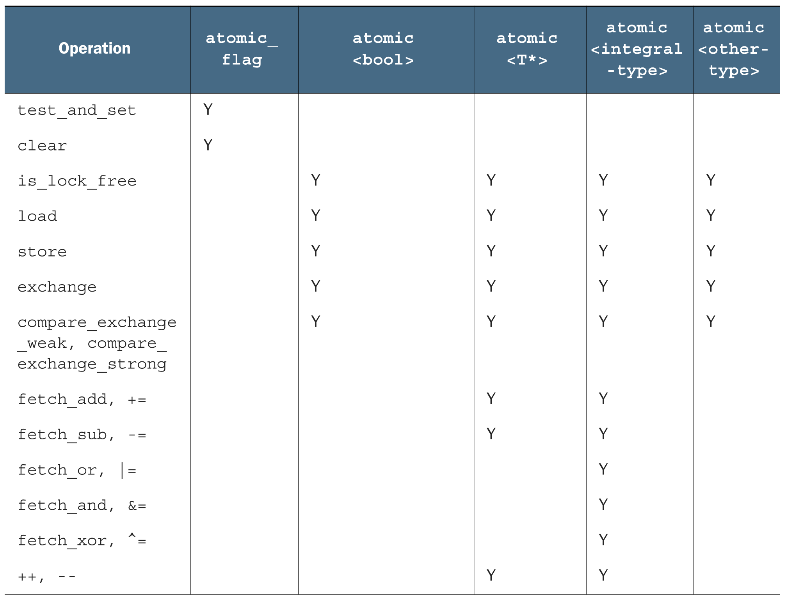

[[toc]]

# 原子类型及原子操作的内存顺序

之前虽然了解过原子类型的基本知识，但是也仅限于了解。最近在做 [sentinel-group/sentinel-rust](https://github.com/sentinel-group/sentinel-rust)，实际应用了一些，但是目前项目里还都是使用的 `Ordering::SeqCst`，即完全顺序化，可能之后会做出一些改进。

## C++ Concurrency in Action

以下的部分内容摘自书籍《C++并发编程实战》的第五章，英文版原名为《C++ Concurrency in Action》。

### 1.1 内存模型

这里有四个需要牢记的原则：

1. 每个变量都是对象，包括其成员变量的对象（注意这里的对象只是在指“存储区域”）。
2. 无论是怎么样的类型，都会存储在一个或多个内存位置上。
3. 基本类型都有确定的内存位置（无论类型大小如何，即使他们是相邻的，或是数组的一部分）。
4. 相邻位域是相同内存中的一部分。

这和并发有什么关系？

### 1.2 对象、内存位置和并发

当两个线程访问不同的内存位置时，不会存在任何问题，当两个线程访问同一个内存位置就要小心了。如果线程不更新数据，只读数据不需要保护或同步。当线程对内存位置上的数据进行修改，就可能会产生条件竞争。这也是为什么会有 “读写锁” 的存在（即 C++ 中的 `std::shared_mutex` 和 Rust 中的 `std::sync::RwLock`），区分 “读” 和 “写” 两种原语，在高频 “读” 时，较普通的互斥锁（即 C++ 中的 `std::mutex` 和 Rust 中的 `std::sync::Mutex`），可以降低开销。

为了避免条件竞争，线程就要以一定的顺序执行。第一种方式，使用互斥量来确定访问的顺序。当同一互斥量在两个线程同时访问前锁住，那么在同一时间内就只有一个线程能够访问对应的内存位置。另一种是使用原子操作决定两个线程的访问顺序，当多个线程访问同一个内存地址时，对每个访问者都需要设定顺序。

如果不规定对同一内存地址访问的顺序，那么访问就不是 “原子” 的。当两个线程都是“写入者”时，就会产生数据竞争和未定义行为。当程序对同一内存地址中的数据访问存在竞争，可以使用原子操作来避免未定义行为。当然，这不会影响竞争的产生——**原子操作并没有指定访问顺序**，它只是会把程序拉回到定义行为的区域内，即两个写操作也不会互相干扰，所以需要程序员指定执行顺序。

如果对象不是原子类型，必须确保有足够的同步操作（比如互斥量、信号量、conditional variable 等），来确定线程都遵守了修改顺序。如果使用原子操作，编译器就有责任去做同步，去使用机器的原子指令，或是在机器没有对应指令时，重新生成带锁的代码。

- 当然，原子指令往往比一般的运算指令要慢，但是如果机器上有原子指令，还是比加锁要快的。但是在 Rust 实践中，原子类型破坏了代码中的可变标识  `mut` 。毕竟 `mut` 关键字本身就可以防止因为不确定的读写顺序，导致的数据竞争和未定义行为（因为同一时刻只能有一个可变引用存在，它甚至不可以和不可变引用同时存在）。所以对于外部直接使用容器的用户来说，只能依赖函数名和注释来判断函数的用途，而无法通过函数签名中的参数类型确认了。

- 当然，执行并发操作也不一定要访问共享内存，常见的如 go 中使用的 CSP model，通过 channel 通信；Erlang 中的 Actor model；Rust 中基于 Actor model 的 `Actix` 库、Rust 标准库中的各类通信 channel；往大里说，Map-Reduce 也是如此。

### 2.0 原子操作和原子类型

这部分就是很基础的，只需要看看它们都有啥 API 就好。C++ 的标准原子类型定义在头文件 `<atomic> `中，Rust 在 `std::sync::atomic` 下。原子类型有两种实现方式：

- 机器硬件上有对应的原子指令。

- 也可以用互斥锁来模拟原子操作。

它们大多有一个 `is_lock_free()` 成员函数，这个函数可以让用户查询某原子类型的操作是直接用的原子指令（`x.is_lock_free()` 返回 `true`），还是内部用了一个锁结构（`x.is_lock_free()` 返回 `false`）。C++17中，所有原子类型有一个 `static constexpr` 成员变量，如果相应硬件上的原子类型X是无锁类型，那么 `X::is_always_lock_free`将返回 `true`。

只有`std::atomic_flag`类型不提供 `is_lock_free()`。该类型是一个简单的布尔标志，并且在这种类型上的操作都是无锁的。当有一个简单无锁的布尔标志时，可以使用该类型实现一个简单的锁，并且可以通过这个锁来实现其他基础原子类型（即上面提到的第二种原子类型的实现方式）。剩下的原子类型都可以通过特化`std::atomic<>`得到，并且拥有更多的功能，但不可能都是无锁的。

通常，标准原子类型不能进行拷贝和赋值，它们没有拷贝构造函数和拷贝赋值操作符。但是，可以隐式转化成对应的内置类型，所以这些类型依旧支持赋值。赋值操作和成员函数的返回值，要么是存储值（赋值操作），要么是操作值（命名函数），这就能避免赋值操作符返回引用。具体而言，支持的运算如下：



每种函数类型的操作都有一个内存序参数，这个参数可以用来指定存储的顺序。不同的内存序在不同的CPU架构下功耗不同，如果有多个处理器，额外的同步指令会消耗大量的时间，从而降低系统性能。

为了兼容 C 的风格，也提供了非成员函数。大多数非成员函数的命名与对应成员函数有关，需要`atomic_`作为前缀(比如，`std::atomic_load()`)。这些函数都会重载不同的原子类型，指定内存序时会分成两种：一种没有标签，另一种以`_explicit`为后缀，并且需要额外的参数，或将内存序作为标签，亦或只有标签(例如，`std::atomic_store(&atomic_var,new_value)`与`std::atomic_store_explicit(&atomic_var,new_value,std::memory_order_release`)。C 里面没有引用的概念，传的是指针。

标准原子类型不仅仅是为了避免数据竞争所造成的未定义行为，还允许用户对不同线程上的操作进行强制排序。这种强制排序是数据保护和同步操作的基础，例如：`std::mutex`和`std::future`。

:::tip

 `compare_exchange_strong`  和  `compare_exchange_weak` 是 compare-and-swap （CAS）操作，涉及到比较、交换两个步骤。但是和 `compare_exchange_strong` 不同， `compare_exchange_weak` 允许在比较成功时失败，即交换步骤可以失败，这在某些平台上更加高效 （比如你在循环质询某个值）。 而 `compare_exchange_strong` 只有在比较时，原值不等于期望值时才会失败。

:::

### 3.3 原子操作的内存顺序

对于原子操作，可能的内存顺序如下：

1. Store（写）操作，可选如下内存序：`memory_order_relaxed`, `memory_order_release`, `memory_order_seq_cst`。
2. Load（读）操作，可选如下内存序：`memory_order_relaxed`, `memory_order_consume`, `memory_order_acquire`, `memory_order_seq_cst`。
3. Read-modify-write（读-改-写）操作，可选如下内存序：`memory_order_relaxed`, `memory_order_consume`, `memory_order_acquire`, `memory_order_release`, `memory_order_acq_rel`, `memory_order_seq_cst`。

虽然有六个选项，但仅代表三种内存模型：顺序一致性 (sequentially consistent)，获取-释放序 (memory_order_consume, memory_order_acquire, memory_order_release 和 memory_order_acq_rel) 和自由序 (memory_order_relaxed)。

#### 顺序一致性

默认序命名为顺序一致性，因为程序中的行为从任意角度去看，序列都保持一定顺序。如果原子实例的所有操作都是序列一致的，那么多线程就会如单线程那样以某种特殊的排序执行。目前来看，该内存序是最容易理解的，这也是将其设置为默认的原因：不同的操作也要遵守相同的顺序。因为行为简单，可以使用原子变量进行编写。通过不同的线程，可以写出所有可能的操作消除那些不一致，以及确认代码的行为是否与预期相符。所以，操作都不能重排；如果代码在一个线程中，将一个操作放在另一个操作前面，那其他线程也需要了解这个顺序。

不过，简单就要付出代价。多核机器会加强对性能的惩罚，因为整个序列中的操作都必须在多个处理器上保持一致，可能需要对处理器间的同步操作进行扩展，这份代价很昂贵！即便如此，一些处理器架构，比如通用 x86 和 x86-64 架构就提供了相对廉价的顺序一致性，所以需要考虑使用顺序一致性对性能的影响，就需要去查阅目标处理器的架构文档进行更多的了解。

**序列一致性是最简单、直观的序列，因为需要对所有线程进行全局同步，所以也是开销最大的内存序。多处理器设备上需要在处理期间，在信息交换上耗费大量的时间。为了避免这种消耗，就需考虑使用其他内存序。**

#### 非顺序一致性内存

当踏出序列一致的世界时，事情就开始复杂了。不同线程看到相同操作，不一定有着相同的顺序，还有对于不同线程的操作，都会一个接着另一个执行的想法就不可行了。不仅是考虑事情同时发生的问题，还有线程没办法保证一致性。为了写出(或仅是了解)一段使用非默认内存序列的代码，绝不仅是编译器重新排列指令的事情。即使线程运行相同的代码，都能拒绝遵循事件发生的顺序，因为操作在其他线程上没有明确的顺序限制，不同的CPU缓存和内部缓冲区，在同样的存储空间中可以存储不同的值。这非常重要，这里再重申一次：线程没办法保证一致性。

不仅是要摒弃串行的想法，还要放弃编译器或处理器重排指令的想法。没有明确顺序限制时，就需要所有线程要对每个独立变量统一修改顺序。对不同变量的操作可以体现在不同线程的不同序列上，提供的值要与任意附加顺序限制保持一致。

踏出排序一致世界后，就使用memory_order_relaxed对所有操作进行约束。如果已经有所了解，可以跳到获取-释放序继续阅读，获取-释放序允许在操作间引入顺序关系。

#### 自由序

原子类型上的操作以自由序执行。同一线程中对于同一变量的操作还是遵从先行关系，但不同线程不需要规定顺序。唯一的要求是在访问同一线程中的单个原子变量不能重排序，当给定线程看到原子变量的值时，随后线程的读操作就不会去检索较早的那个值。当使用memory_order_relaxed时，不需要任何额外的同步，对于每个变量的修改顺序只存在于线程间共享。

**理解自由序**

为了了解自由序是如何工作的，可先将每一个变量想象成在一个独立房间中拿着记事本的人。他的记事本上是一组值的列表，可以通过打电话的方式让他给你一个值，或让他写下一个新值。如果告诉他写下一个新值，他会将这个新值写在表的最后。如果让他给你一个值，他会从列表中读取一个值给你。

第一次与这人交谈时，如果问他要一个值，他可能会在现有的列表中选区任意值告诉你。如果之后再问他要一个值，可能会得到与之前相同的值，或是列表下端的其他值，他不会给你列表上端的值。如果让他写一个值，并且随后再问他要一个值，他要不就给你你刚告诉他的那个值，要不就是一个列表下端的值。

试想当他的笔记本上开始有5，10，23，3，1，2这几个数。如果问他索要一个值，你可能获取这几个数中的任意一个。如果他给你10，那么下次再问他要值的时候可能会再给你10，或者10后面的数，但绝对不会是5。如果那你问他要了五次，他就可能回答“10，10，1，2，2”。如果你让他写下42，他将会把这个值添加在列表的最后。如果你再问他要值，他可能会告诉你“42”，直到有其他值写在了后面，并且他愿意将那个数告诉你。

现在，你有个朋友叫Carl，他也有那个计数员的电话。Carl也可以打电话给计算员，让他写下一个值或获取一个值，他对Carl回应的规则和你是一样的。他只有一部电话，所以一次只能处理一个人的请求，所以他记事本上的列表是一个简单的列表。但是，你让他写下一个新值的时候，不意味着他会将这个消息告诉Carl，反之亦然。如果Carl从他那里获取一个值“23”，之后因为你告诉他写下42，这不意味着下次他会将这件事告诉Carl。他可能会告诉Carl任意一个值，23，3，1，2，42亦或是67(是Fred在你之后告诉他的)。他会很高兴的告诉Carl“23，3，3，1，67”，与你告诉他的值完全不一致，这就像在使用便签跟踪告诉每个人的数字，如下图。


现在，不仅仅有一个人在房间里，而是在一个小农场里，每个人都有一部电话和一个笔记本，这就是原子变量。每一个变量拥有自己的修改顺序(笔记上的简单数值列表)，但是每个原子变量之间没有任何关系。如果每一个调用者(你，Carl，Anne，Dave和Fred)是一个线程，对每个操作使用memory_order_relaxed就会得到上面的结果。还有些事情可以告诉小房子里的人，例如：“写下这个值，并且告诉我现在列表中的最后一个值”(exchange)，或“写下这个值，当列表的最后一个值为某值时，会进行猜测，如果猜错了，则告诉我最后一个值是多少”(compare_exchange_strong)，这些都不影响一般性原则。

**要想获取额外的同步，且不使用全局排序一致，可以使用获取-释放序 (acquire-release ordering)**。

#### 获取-释放序

这是自由序 (relaxed ordering) 的加强版，虽然操作依旧没有统一顺序，但引入了同步。**这种序列模型中，原子加载就是获取 (acquire) 操作 (memory_order_acquire)，原子存储就是释放 (memory_order_release) 操作，原子读-改-写操作 (例如 `fetch_add()` 或`exchange()` ) 在这里，不是“获取”就是“释放”，或者两者兼有的操作 (memory_order_acq_rel)。**同步在线程释放和获取间是**成对的**(pairwise)，释放操作与获取操作同步就能读取已写入的值。

**理解获取-释放序**

也可以将获取-释放序与之前提到记录员相关联，这样就需要添加很多东西到模型中。首先，每个存储操作做一部分更新，当你联系一个人时，让他写下一个数字，也需要告诉他更新哪一部分：“请在423组中写下99”。对于某一组的最后一个值的存储，你也需要告诉那个人：“请写下147，这是最后存储在423组的值”。隔间中的人会及时写下这一信息，并注明这个值的来源，这个就是存储-释放操作的模型。下一次，你告诉另外一个人写下一组值时，需要改变组号：“请在424组中写入41”

当你询问时就要做出一个选择：要不就仅仅询问一个值(这就是次自由加载，这种情况下，隔间中的人会给你的)，要不就询问一个值以及其关于组的信息(是否是某组中的最后一个，这就是加载-获取模型)。当你询问组信息，且值不是组中的最后一个，隔间中的人会这样告诉你，“这个值是987，它是一个普通值”，但当这个值是最后一个时，他会告诉你：“数字为987，这个值是956组的最后一个，来源于Anne”。这样，获取-释放的语义就很明确了：当查询一个值，你告诉他所有组后，他会低头查看列表，看你给的这些数是不是在对应组的最后，并且告诉你那个值的属性，或继续在列表中查询。

**如何选择**

使用“读-改-写”操作，选择语义就很重要了。如果想要同时进行获取和释放的语义，所以 memory_order_acq_rel 是一个不错的选择，但也可以使用其他内存序。即使存储了一个值，使用 memory_order_acquire 语义的 fetch_sub 不会和任何东西同步的，因为没有释放操作。同样，使用 memory_order_release 语义的 fetch_or 也不会和任何存储操作进行同步，因为对于 fetch_or 的读取，并不是一个获取操作。使用 memory_order_acq_rel 语义的“读-改-写”操作，每一个动作都包含获取和释放操作，所以可以和之前的存储操作进行同步，并且可以对随后的加载操作进行同步，就像上面例子一样。

如果将获取-释放和序列一致进行混合，“序列一致”的加载动作就如使用了获取语义的加载操作，序列一致的存储操作就如使用了释放语义的存储，“序列一致”的读-改-写操作行为就如使用了获取和释放的操作。“自由操作”依旧那么自由，但其会和额外的同步进行绑定(也就是使用“获取-释放”的语义)。

尽管结果并不那么直观，每个使用锁的同学都需要了解：**锁住互斥量是一个获取操作，并且解锁这个互斥量是一个释放操作。**随着互斥量的增多，必须确保同一个互斥量在读取变量或修改变量时上锁，所以获取和释放操作必须在同一个变量上，以保证访问顺序。当互斥量保护数据时，因为锁住与解锁的操作都是序列一致的操作，就保证了结果一致。当对原子变量使用获取和释放序时，代码必然会使用锁，即使内部操作序不一致，其外部表现将会为序列一致。

**当原子操作不需要严格的序列一致序时，可以提供成对同步的获取-释放序，这种比全局序列一致性的成本更低，且有同步操作。为了保证序列能够正常的工作，这里还需要一些权衡，还要保证隐式的跨线程行为是没有问题的。**

#### 获取-释放序和memory_order_consume的数据相关性

介绍本章节的时候，说过 memory_order_consume 是“获取-释放”模型的一部分，但并没有对其进行过多的讨论。因为 memory_order_consume 很特别：完全依赖于数据，并且其展示了与线程间先行关系的不同之处。这个内存序非常特殊，即使在C++17中也不推荐使用。这里只为了完整的覆盖内存序而讨论， memory_order_consume 不应该出现在代码中。Rust 中也没有迁移该顺序。

数据依赖的概念相对简单：第二个操作依赖于第一个操作的结果，这样两个操作之间就有了数据依赖。这里有两种新关系用来处理数据依赖：*前序依赖* (dependency-ordered-before) 和*携带依赖* (carries-a-dependency-to)。携带依赖对于数据依赖的操作，严格应用于一个独立线程和其基本模型。如果 A 操作结果要使用操作B的操作数，则 A 将携带依赖于 B。如果 A 操作的结果是一个标量 (比如 `int`)，而后的携带依赖关系仍然适用于，当 A 的结果存储在一个变量中，并且这个变量需要被其他操作使用。这个操作可以传递，所以当 A 携带依赖 B，并且 B 携带依赖 C，就可以得出 A 携带依赖 C 的关系。

当不影响线程间的先行关系时，对于同步来说没有任何好处：当 A 前序依赖 B，那么 A 线程间也前序依赖 B。

这种内存序在原子操作载入指向数据的指针时很重要，当使用 memory_order_consume 作为加载语义，并且 memory_order_release 作为存储语义时，就要保证指针指向的值已同步，并且不要求其他非独立数据同步。

### 3.5 栅栏

栅栏操作，`std::atomic_thread_fence(a_memory_order)`，会对内存序列进行约束，使其无法对任何数据进行修改，典型的做法是与使用 memory_order_relaxed 约束序的原子操作一起使用。栅栏属于全局操作，执行栅栏操作可以影响到在线程中的其他原子操作。因为这类操作就像画了一条任何代码都无法跨越的线一样，所以栅栏操作通常也被称为*内存栅栏* (memory barriers) 。回忆一下 3.3 节，Relaxed 顺序下的自由操作可以使用编译器或者硬件的方式，在独立的变量上自由的重新排序。不过，栅栏操作就会限制这种自由。

### 3.7 非原子操作排序

对非原子操作的排序，可以通过使用原子操作进行，“序前”作为“先行”的一部分，如果一个非原子操作是“序前”于一个原子操作，并且这个原子操作需要“先行”与另一个线程的操作，那么这个非原子操作也就“先行”于在其他线程的操作了。 对于C++标准库的高级同步工具来说，这些只是基本工具。

总而言之，C++ 标准库提供了大量的同步机制，这些机制会为同步关系之间的顺序进行保证。这样就可以使用它们进行数据同步，并保证同步关系间的顺序。**以下的工具都可以提供同步**：

**std::thread**

* std::thread构造新线程时，构造函数与调用函数或新线程的可调用对象间的同步。
* 对std::thread对象调用join，可以和对应的线程进行同步。

**std::mutex, std::timed_mutex, std::recursive_mutex, std::recursibe_timed_mutex**

* 对给定互斥量对象调用lock和unlock，以及对try_lock，try_lock_for或try_lock_until，会形成该互斥量的锁序。
* 对给定的互斥量调用unlock，需要在调用lock或成功调用try_lock，try_lock_for或try_lock_until之后，这样才符合互斥量的锁序。
* 对try_lock，try_lock_for或try_lock_until失败的调用，不具有任何同步关系。

**std::shared_mutex ,  std::shared_timed_mutex**

* 对给定互斥量对象调用lock、unlock、lock_shared和unlock_shared，以及对 try_lock ,  try_lock_for ,  try_lock_until ,  try_lock_shared ,  try_lock_shared_for或 try_lock_shared_until的成功调用，会形成该互斥量的锁序。
* 对给定的互斥量调用unlock，需要在调用lock或shared_lock，亦或是成功调用try_lock ,  try_lock_for,  try_lock_until,  try_lock_shared,  try_lock_shared_for或try_lock_shared_until之后，才符合互斥量的锁序。
* 对try_lock，try_lock_for，try_lock_until，try_lock_shared，try_lock_shared_for或try_lock_shared_until 失败的调用，不具有任何同步关系。

**std::shared_mutex和std::shared_timed_mutex**

* 成功的调用std::promise对象的set_value或set_exception与成功的调用wait或get之间同步，或是调用wait_for或wait_until的返回例如future状态std::future_status::ready与promise共享同步状态。
* 给定std::promise对象的析构函数，该对象存储了一个std::future_error异常，成功的调用wait或get后，共享同步状态与promise之间的同步，或是调用wait_for或wait_until返回的future状态std::future_status::ready时，与promise共享同步状态。

**std::packaged_task ,  std::future和std::shared_future**

* 成功的调用std::packaged_task对象的函数操作符与成功的调用wait或get之间同步，或是调用wait_for或wait_until的返回future状态std::future_status::ready与打包任务共享同步状态。
* std::packaged_task对象的析构函数，该对象存储了一个std::future_error异常，其共享同步状态与打包任务之间的同步在于成功的调用wait或get，或是调用wait_for或wait_until返回的future状态std::future_status::ready与打包任务共享同步状态。

**std::async ,  std::future和std::shared_future**

* 使用std::launch::async策略性的通过std::async启动线程执行任务与成功的调用wait和get之间是同步的，或调用wait_for或wait_until返回的future状态std::future_status::ready与产生的任务共享同步状态。
* 使用std::launch::deferred策略性的通过std::async启动任务与成功的调用wait和get之间是同步的，或调用wait_for或wait_until返回的future状态std::future_status::ready与promise共享同步状态。

**std::experimental::future ,  std::experimental::shared_future和持续性**

* 异步共享状态变为就绪的事件与该共享状态上调度延续函数的调用同步。
* 持续性函数的完成与成功调用wait或get的返回同步，或调用wait_for或wait_until返回的期望值状态std::future_status::ready与调用then构建的持续性返回的future同步，或是与在调度用使用这个future的操作同步。

**std::experimental::latch**

* 对std::experimental::latch实例调用count_down或count_down_and_wait与在该对象上成功的调用wait或count_down_and_wait之间是同步的。

**std::experimental::barrier**

* 对std::experimental::barrier实例调用arrive_and_wait或arrive_and_drop与在该对象上随后成功完成的arrive_and_wait之间是同步的。

**std::experimental::flex_barrier**

* 对std::experimental::flex_barrier实例调用arrive_and_wait或arrive_and_drop与在该对象上随后成功完成的arrive_and_wait之间是同步的。
* 对std::experimental::flex_barrier实例调用arrive_and_wait或arrive_and_drop与在该对象上随后完成的给定函数之间是同步的。
* 对std::experimental::flex_barrier实例的给定函数的返回与每次对arrive_and_wait的调用同步，当调用给定函数线程会在栅栏处阻塞等待。

**std::condition_variable和std::condition_variable_any**

* 条件变量不提供任何同步关系，它们是对忙等待的优化，所有同步都由互斥量提供。

## CPP Reference：`std::memory_order`

| Value                  | Explanation                                                  |
| ---------------------- | ------------------------------------------------------------ |
| `memory_order_relaxed` | Relaxed operation: there are no synchronization or ordering constraints imposed on other reads or writes, only this operation's atomicity is guaranteed (see [Relaxed ordering](https://en.cppreference.com/w/cpp/atomic/memory_order#Relaxed_ordering) below) |
| `memory_order_consume` | A load operation with this memory order performs a *consume operation* on the affected memory location: no reads or writes in the current thread dependent on the value currently loaded can be reordered before this load. Writes to data-dependent variables in other threads that release the same atomic variable are visible in the current thread. On most platforms, this affects compiler optimizations only (see [Release-Consume ordering](https://en.cppreference.com/w/cpp/atomic/memory_order#Release-Consume_ordering) below) |
| `memory_order_acquire` | A load operation with this memory order performs the *acquire operation* on the affected memory location: no reads or writes in the current thread can be reordered before this load. All writes in other threads that release the same atomic variable are visible in the current thread (see [Release-Acquire ordering](https://en.cppreference.com/w/cpp/atomic/memory_order#Release-Acquire_ordering) below) |
| `memory_order_release` | A store operation with this memory order performs the *release operation*: no reads or writes in the current thread can be reordered after this store. All writes in the current thread are visible in other threads that acquire the same atomic variable (see [Release-Acquire ordering](https://en.cppreference.com/w/cpp/atomic/memory_order#Release-Acquire_ordering) below) and writes that carry a dependency into the atomic variable become visible in other threads that consume the same atomic (see [Release-Consume ordering](https://en.cppreference.com/w/cpp/atomic/memory_order#Release-Consume_ordering) below). |
| `memory_order_acq_rel` | A read-modify-write operation with this memory order is both an *acquire operation* and a *release operation*. No memory reads or writes in the current thread can be reordered before or after this store. All writes in other threads that release the same atomic variable are visible before the modification and the modification is visible in other threads that acquire the same atomic variable. |
| `memory_order_seq_cst` | A load operation with this memory order performs an *acquire operation*, a store performs a *release operation*, and read-modify-write performs both an *acquire operation* and a *release operation*, plus a single total order exists in which all threads observe all modifications in the same order (see [Sequentially-consistent ordering](https://en.cppreference.com/w/cpp/atomic/memory_order#Sequentially-consistent_ordering) below) |

原文链接： [Cpp Reference](https://en.cppreference.com/w/cpp/atomic/memory_order)

## Rust 死灵书： Atomics

相关类型和 Ordering 定义在 `std::sync::atomic` 下。

Rust 在 Atomics Ordering 的设计上继承了C++20，这并不是因为这个模型设计的有多么出色，多么容易理解。事实上，这个模型很复杂，而且有一些已知的 [缺陷](http://plv.mpi-sws.org/c11comp/popl15.pdf)。

Rather, it is a pragmatic concession to the fact that *everyone* is pretty bad at modeling atomics. At very least, we can benefit from existing tooling and research around the C/C++ memory model. (You'll often see this model referred to as "C/C++11" or just "C11". C just copies the C++ memory model; and C++11 was the first version of the model but it has received some bugfixes since then.)

Trying to fully explain the model in this book is fairly hopeless. It's defined in terms of madness-inducing causality graphs that require a full book to properly understand in a practical way. If you want all the nitty-gritty details, you should check out the [C++ specification](https://en.cppreference.com/w/cpp/atomic/memory_order). Still, we'll try to cover the basics and some of the problems Rust developers face.

The C++ memory model is fundamentally about trying to bridge the gap between the semantics we want, the optimizations compilers want, and the inconsistent chaos our hardware wants. *We* would like to just write programs and have them do exactly what we said but, you know, fast. Wouldn't that be great?

原文链接： [The Rustonomicon](https://doc.rust-lang.org/nomicon/atomics.html)

## AtomicF64 的实现

当然用 `AtomicPtr` 实现，替换掉指针是可以的。但是有一种更加有趣的做法是用 `AtomicU64` 来存储，然后写入和读取的时候做转换就行了。

例如，在 [Prometheus 的 Rust Client](https://github.com/tikv/rust-prometheus) 实现中，就是这么干的，直接用了 `f64::from_bits()` 和 `f64::to_bits()` 做转化：

```rust
//! prometheus-0.12.0/src/atomic64.rs
/// A atomic float.
#[derive(Debug)]
pub struct AtomicF64 {
    inner: StdAtomicU64,
}

#[inline]
fn u64_to_f64(val: u64) -> f64 {
    f64::from_bits(val)
}

#[inline]
fn f64_to_u64(val: f64) -> u64 {
    f64::to_bits(val)
}

impl Atomic for AtomicF64 {
    type T = f64;

    fn new(val: Self::T) -> AtomicF64 {
        AtomicF64 {
            inner: StdAtomicU64::new(f64_to_u64(val)),
        }
    }

    #[inline]
    fn set(&self, val: Self::T) {
        self.inner.store(f64_to_u64(val), Ordering::Relaxed);
    }

    #[inline]
    fn get(&self) -> Self::T {
        u64_to_f64(self.inner.load(Ordering::Relaxed))
    }

    #[inline]
    fn inc_by(&self, delta: Self::T) {
        loop {
            let current = self.inner.load(Ordering::Acquire);
            let new = u64_to_f64(current) + delta;
            let result = self.inner.compare_exchange_weak(
                current,
                f64_to_u64(new),
                Ordering::Release,
                Ordering::Relaxed,
            );
            if result.is_ok() {
                return;
            }
        }
    }

    #[inline]
    fn dec_by(&self, delta: Self::T) {
        self.inc_by(-delta);
    }
}

impl AtomicF64 {
    /// Store the value, returning the previous value.
    pub fn swap(&self, val: f64, ordering: Ordering) -> f64 {
        u64_to_f64(self.inner.swap(f64_to_u64(val), ordering))
    }
}
```

